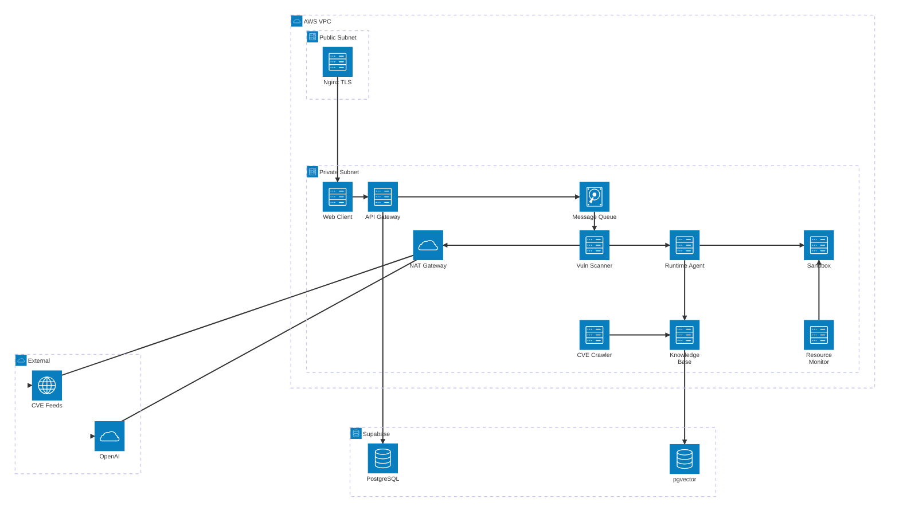

# KILLHOUSE — AWS Infrastructure Architecture

> `architecture-beta` 다이어그램 + 네트워크 · OSI 매핑 통합 문서
>
> EC2 자체 호스팅 (Nginx + Let's Encrypt + DDNS)

---

## 1. 모듈 명칭 통일

| ID | 정규 명칭 | 다이어그램 ID | 설명 |
|---|---|---|---|
| M1 | **web-client** | `webcli` | Next.js 프론트 |
| M2 | **api-gateway** | `apigw` | 메인 백엔드 |
| M3 | **message-queue** | `mq` | 비동기 작업 큐 |
| M4 | **vuln-scanner** | `scan` | SAST, SCA, IaC 워커 |
| M5 | **runtime-agent** | `agent` | LLM AI 에이전트 |
| M6 | **sandbox** | `sbox` | Docker in Docker |
| M7 | **knowledge-base** | `kb` | RAG 파이프라인 |
| M8 | **cve-crawler** | `crawl` | CVE 크롤러 |
| M9 | **resource-monitor** | `resmon` | 메트릭 수집 |

---

## 2. 통합 AWS 인프라 다이어그램



> **범례:** `-->` 단방향 요청 · `--` 양방향 · 그룹 = 네트워크 경계
>
> 모든 통신 상세(포트, 프로토콜)는 §3 테이블 참조

---

## 3. 포트 및 프로토콜 매핑

| From → To | Port | Protocol | 비고 |
|---|---|---|---|
| User → Nginx | 443/TCP | HTTPS (TLS 1.3) | Let's Encrypt |
| Nginx → Web Client | 3000/TCP | HTTP | TLS 종단은 Nginx |
| Web Client → API Gateway | 8000/TCP | HTTP REST + JSON | VPC 내부 |
| API Gateway → Message Queue | 5672/TCP | AMQP 0-9-1 | 비동기 enqueue |
| Message Queue → Vuln Scanner | 5672/TCP | AMQP 0-9-1 | Worker pull |
| Vuln Scanner → Runtime Agent | 50051/TCP | gRPC (HTTP/2 + Protobuf) | 바이너리 직렬화 |
| Runtime Agent → NAT → OpenAI | 443/TCP | HTTPS REST + JSON | NAT Gateway 경유 |
| Runtime Agent → Sandbox | 2376/TCP or Unix Socket | Docker Engine API | DiD 격리 |
| Scanner/Agent → Knowledge Base | 8080/TCP | HTTP REST + JSON | RAG 쿼리 |
| CVE Crawler → NAT → CVE Sources | 443/TCP | HTTPS | NVD, GHSA |
| CVE Crawler → Knowledge Base | 8080/TCP | HTTP | 청크, 임베딩 전달 |
| API Gateway → Supabase PG | 5432/TCP | PostgreSQL (TLS) | Connection Pool |
| Runtime Agent → Supabase PG | 5432/TCP | PostgreSQL (TLS) | 리포트 저장 |
| Knowledge Base → pgvector | 5432/TCP | PostgreSQL + pgvector (TLS) | 벡터 검색 |
| Resource Monitor → Sandbox | 2376/TCP or Unix Socket | Docker Engine API | 메트릭 수집 |
| Resource Monitor → Vuln Scanner | 내부 TCP | HTTP | 큐 길이, 처리량 |
| Resource Monitor → API Gateway | 8000/TCP | HTTP REST | 임계치 경고 |
| API Gateway → Web Client (push) | 3000/TCP | WebSocket / SSE | 실시간 알림 |

---

## 4. OSI 계층 매핑

| # | 구간 | L3 | L4 | L5-6 | L7 |
|---|---|---|---|---|---|
| 1 | User → Nginx | IP Public | TCP 443 | TLS 1.3 | HTTPS |
| 2 | Nginx → Web Client | IP VPC | TCP 3000 | 없음 | HTTP |
| 3 | Web Client → API Gateway | IP VPC | TCP 8000 | 없음 | HTTP REST |
| 4 | API Gateway → Message Queue | IP VPC | TCP 5672 | 없음 | AMQP 0-9-1 |
| 5 | Message Queue → Vuln Scanner | IP VPC | TCP 5672 | 없음 | AMQP 0-9-1 |
| 6 | Vuln Scanner → Runtime Agent | IP VPC | TCP 50051 | 없음 | gRPC HTTP/2 |
| 7 | Runtime Agent → OpenAI | IP Public | TCP 443 | TLS 1.3 | HTTPS REST |
| 8 | Runtime Agent → Sandbox | IP VPC | Socket or TCP 2376 | 없음 | Docker API |
| 9 | Scanner/Agent → Knowledge Base | IP VPC | TCP 8080 | 없음 | HTTP REST |
| 10 | All → Supabase | IP Public | TCP 5432 | TLS 1.2+ | PostgreSQL Wire |
| 11 | CVE Crawler → CVE Sources | IP Public | TCP 443 | TLS 1.3 | HTTPS REST |
| 12 | Resource Monitor → Sandbox | IP VPC | Socket or TCP 2376 | 없음 | Docker API |
| 13 | API GW → Web Client push | IP VPC | TCP 3000 | 없음 | WebSocket SSE |

---

## 5. 보안 그룹 규칙

| Security Group | Inbound | Outbound |
|---|---|---|
| **sg-nginx** (Public) | TCP 443, 80 from 0.0.0.0/0 | TCP 3000, 8000 to sg-private |
| **sg-private** | TCP 3000, 8000 from sg-nginx. VPC 내부 전체 허용 | TCP 443 via NAT GW. TCP 5432 via NAT GW |
| **sg-sandbox** (DiD) | TCP 2376 from agent, resmon ONLY | DENY ALL |

---

## 6. DDNS + TLS 자체 호스팅

```
User Browser
  │  DNS (killhouse.duckdns.org)
  ▼
DDNS ── A Record ──▶ EC2 Elastic IP
  │  HTTPS 443
  ▼
┌──────────────────────────────┐
│  Nginx (Public Subnet)       │
│  TLS (Let's Encrypt)         │
│  /      → :3000 (WEB)        │
│  /api/* → :8000 (API)        │
│  /ws/*  → :8000 (WS)         │
└──────────────────────────────┘
       │        │
    :3000    :8000
       ▼        ▼
┌──────────────────────────────┐
│  Private Subnet              │
│  Web Client  API Gateway ... │
└──────────────────────────────┘
```

```bash
# DDNS 갱신 (5분 주기)
*/5 * * * * root curl -s "https://www.duckdns.org/update?domains=killhouse&token=YOUR_TOKEN&ip=" > /dev/null

# Let's Encrypt
certbot --nginx -d killhouse.duckdns.org --non-interactive --agree-tos -m admin@killhouse.dev
```

---

## 7. 전체 패킷 흐름 (스캔 요청)

```
1. User Browser
   HTTPS 443 (TLS 1.3) → DDNS → Elastic IP

2. Nginx (Public Subnet)
   TLS 종단 → HTTP 3000 → Web Client

3. Web Client
   HTTP 8000 → API Gateway (POST /scans, JWT)

4. API Gateway
   ├ TCP 5432 TLS → Supabase PG (INSERT)
   └ AMQP 5672 → Message Queue (enqueue)

5. Message Queue
   AMQP 5672 → Vuln Scanner (dequeue)

6. Vuln Scanner
   ├ HTTP 8080 → Knowledge Base (CVE 검색)
   └ gRPC 50051 → Runtime Agent

7. Runtime Agent
   ├ HTTP 8080 → Knowledge Base (RAG)
   ├ HTTPS 443 → NAT GW → OpenAI
   ├ Docker 2376 → Sandbox
   ├ TCP 5432 TLS → Supabase PG (리포트)
   └ HTTP 8000 → API Gateway (콜백)

8. API Gateway
   WebSocket → Web Client → User
```
