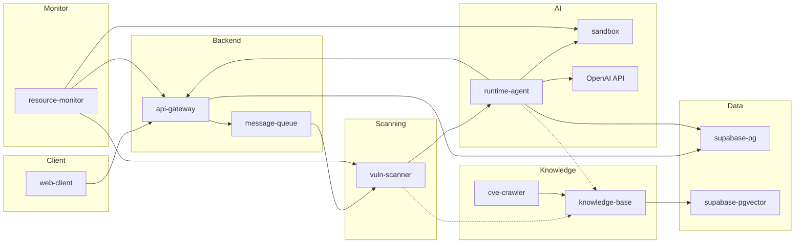

# Architecture Overview

> KILLHOUSE 시스템의 논리적 구조와 모듈 간 의존 관계

---

## High-Level Architecture

---

## Layer 구분

| Layer | 모듈 | 역할 |
|---|---|---|
| **Client** | web-client | 사용자 인터페이스 |
| **Backend** | api-gateway, message-queue | API 처리, 비동기 오케스트레이션 |
| **Scanning** | vuln-scanner | 정적 분석, SCA, IaC 스캔 |
| **AI** | runtime-agent, sandbox, OpenAI | AI 분석, 격리 실행, LLM 판단 |
| **Knowledge** | knowledge-base, cve-crawler | CVE 수집, RAG 파이프라인 |
| **Monitor** | resource-monitor | 리소스 감시, 알림 |
| **Data** | supabase-pg, supabase-pgvector | 영속 저장, 벡터 검색 |

---

## 관련 문서

- [AWS Infrastructure](aws-infrastructure.md) — 인프라 배치, 포트, OSI 매핑
- [Module Reference](module-reference.md) — 모듈 명칭 통일 테이블
- [RFC-001](../rfc/rfc-001-network-topology.md) — 네트워크 토폴로지 설계 근거
