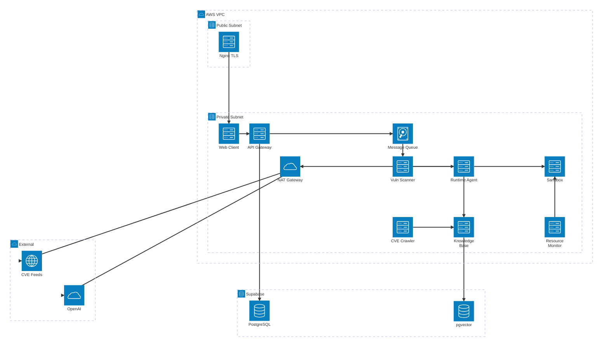

# RFC-001: Network Topology and Security Boundaries

| Field | Value |
|---|---|
| **RFC** | 001 |
| **Title** | Network Topology and Security Boundaries |
| **Author** | TBD |
| **Status** | 📝 Draft |
| **Created** | 2025-XX-XX |
| **Depends on** | — |
| **Blocks** | RFC-002, RFC-003, RFC-004 |

---

## Summary

KILLHOUSE 플랫폼의 AWS VPC 네트워크 구조, 서브넷 분리 정책, TLS 종단 위치, 외부 서비스 연결 경로를 정의한다. Vercel을 사용하지 않고 EC2에서 Nginx + Let's Encrypt + DDNS로 자체 호스팅한다.

---

## Motivation

- 모든 모듈이 단일 서브넷에 배치되면 sandbox 탈출 시 전체 인프라가 노출됨
- 외부 API(OpenAI, Supabase) 접근 경로가 명확하지 않으면 보안 감사 불가
- TLS 종단 위치가 정의되지 않으면 내부 통신 암호화 범위를 판단할 수 없음

---

## Proposal

### VPC 구조

### 서브넷 설계

| Subnet | CIDR | 용도 | Internet Access |
|---|---|---|---|
| Public | 10.0.1.0/24 | Nginx TLS Proxy | Direct (Elastic IP) |
| Private | 10.0.2.0/24 | 모든 애플리케이션 컨테이너 | NAT Gateway Only (Outbound) |

### TLS 종단 정책

| 구간 | 암호화 | 근거 |
|---|---|---|
| Internet → Nginx | TLS 1.3 (Let's Encrypt) | 외부 노출 구간 필수 암호화 |
| Nginx → Private Subnet | 평문 HTTP | 같은 VPC 내부, SG로 격리 |
| Private → Supabase | TLS 1.2+ | 인터넷 경유 (NAT GW) |
| Private → OpenAI | TLS 1.3 | 인터넷 경유 (NAT GW) |

### Security Group 규칙

| SG | Inbound | Outbound |
|---|---|---|
| **sg-nginx** | TCP 443, 80 from 0.0.0.0/0 | TCP 3000, 8000 to sg-private |
| **sg-private** | TCP 3000, 8000 from sg-nginx. VPC self-ref 전체 허용 | TCP 443 via NAT GW. TCP 5432 via NAT GW |
| **sg-sandbox** | TCP 2376 from agent, resmon ONLY | DENY ALL |

### DDNS + Let's Encrypt 구성

- **DDNS**: Duck DNS (또는 Cloudflare) — EC2 Elastic IP를 5분 주기로 갱신
- **TLS**: certbot + nginx plugin, 12시간 주기 자동 갱신
- **Nginx 라우팅**: `/` → web-client:3000, `/api/*` → api-gateway:8000, `/ws/*` → api-gateway:8000 (WebSocket upgrade)

---

## Alternatives

### Alt-1: Vercel + AWS 하이브리드

web-client를 Vercel에 배포하고 API만 AWS에 두는 방식. 프론트 배포가 간편하나, CORS 설정 복잡도 증가 및 Vercel 의존성이 생김. **기각 사유**: 단일 인프라 관리 선호, 비용 통제.

### Alt-2: ALB (Application Load Balancer)

Nginx 대신 AWS ALB를 TLS 종단으로 사용. ACM 인증서 자동 관리가 장점이나, 월 고정 비용($16+)이 초기 단계에 부담. **기각 사유**: 초기 비용 절감 우선. 트래픽 증가 시 재검토.

### Alt-3: Cloudflare Tunnel

Elastic IP 없이 Cloudflare Tunnel로 외부 노출. DDNS 불필요, DDoS 보호 포함. **보류**: 유효한 대안이나 Cloudflare 의존도가 높아짐.

---

## Security Considerations

!!! warning "위협 모델"
    - **Sandbox 탈출**: DiD 컨테이너가 호스트 접근 시 Private Subnet 전체 노출 → sg-sandbox DENY ALL로 완화
    - **NAT GW 남용**: 내부 서비스가 임의 외부 주소 접근 → Outbound SG에 목적지 IP allowlist 적용 검토
    - **DDNS Hijacking**: DNS 레코드 변조 → DDNS 토큰 관리, CAA 레코드 설정

---

## Open Issues

| # | 이슈 | 결정 필요 시점 |
|---|---|---|
| 1 | DDNS provider 최종 선택 (Duck DNS vs Cloudflare) | 인프라 구축 전 |
| 2 | Private Subnet 내부 통신도 mTLS 적용할 것인가 | RFC-002에서 결정 |
| 3 | NAT Gateway 비용 최적화 (VPC Endpoint 활용) | 운영 단계 |
| 4 | Multi-AZ 구성 필요 여부 | 가용성 요구사항 확정 후 |

---

## References

- [AWS VPC Documentation](https://docs.aws.amazon.com/vpc/)
- [Let's Encrypt Documentation](https://letsencrypt.org/docs/)
- [Architecture Diagram](../architecture/aws-infrastructure.md)
- [Module Reference](../architecture/module-reference.md)
