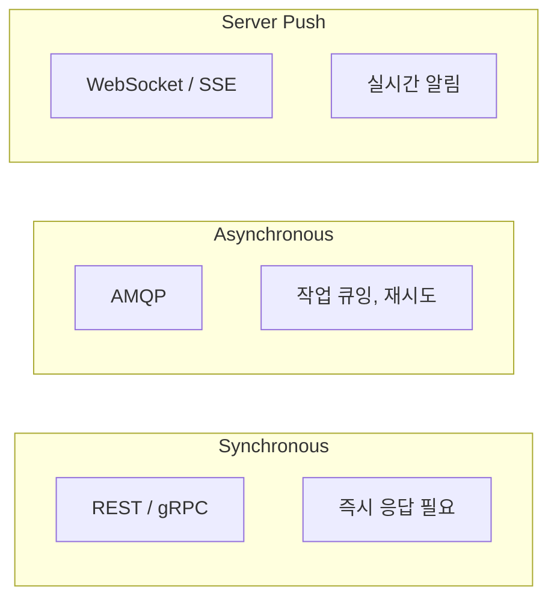

# RFC-002: Inter-Service Communication Protocol

| Field | Value |
|---|---|
| **RFC** | 002 |
| **Title** | Inter-Service Communication Protocol |
| **Author** | TBD |
| **Status** | 📝 Draft |
| **Created** | 2025-XX-XX |
| **Depends on** | RFC-001 |
| **Blocks** | RFC-003 |

---

## Summary

KILLHOUSE 내부 모듈 간 통신에 사용할 프로토콜을 정의한다. 각 구간의 특성(동기/비동기, 데이터 크기, 지연 허용치)에 맞는 프로토콜을 선택하고 그 근거를 문서화한다.

---

## Motivation

- 모듈 간 통신 프로토콜이 통일되지 않으면 디버깅과 모니터링이 어려워짐
- 스캔 결과처럼 큰 페이로드를 전달하는 구간과 상태 체크처럼 가벼운 구간은 다른 프로토콜이 적합
- 프로토콜 선택이 확정되어야 API 스펙, 에러 핸들링, 재시도 정책을 설계할 수 있음

---

## Proposal

### 프로토콜 매핑

| 구간 | Protocol | Port | 선택 근거 |
|---|---|---|---|
| Web Client → API Gateway | HTTP REST + JSON | 8000 | 표준 웹 API, 프론트 호환성 |
| API Gateway → Message Queue | AMQP 0-9-1 | 5672 | 비동기 작업 큐, 메시지 보장 |
| Message Queue → Vuln Scanner | AMQP 0-9-1 | 5672 | Worker pull 패턴 |
| Vuln Scanner → Runtime Agent | gRPC (HTTP/2) | 50051 | 바이너리 직렬화, 스트리밍 지원, 대용량 스캔 결과 |
| Scanner/Agent → Knowledge Base | HTTP REST + JSON | 8080 | 단순 조회, 범용성 |
| Runtime Agent → OpenAI | HTTPS REST + JSON | 443 | OpenAI API 스펙 준수 |
| Runtime Agent → Sandbox | Docker Engine API | 2376 | 컨테이너 제어 표준 |
| All → Supabase | PostgreSQL Wire Protocol | 5432 | 데이터베이스 표준 |
| API Gateway → Web Client (push) | WebSocket / SSE | 3000 | 실시간 알림 |

### 동기 vs 비동기 구분

| 패턴 | 적용 구간 | 특성 |
|---|---|---|
| **Sync Request-Reply** | Web → API, Scanner → Agent, Agent → OpenAI | 호출자가 응답 대기 |
| **Async Fire-and-Forget** | API → MQ → Scanner | 호출자는 job_id만 받고 복귀 |
| **Server Push** | API → Web Client | 스캔 완료 등 이벤트 알림 |

### 에러 핸들링 정책

| 구간 | Timeout | Retry | Fallback |
|---|---|---|---|
| Web → API | 30s | Client-side 1회 | 에러 페이지 |
| API → MQ | 5s | 3회 (exponential backoff) | Dead Letter Queue |
| Scanner → Agent | 120s | 없음 (MQ에서 재처리) | MQ로 반환 |
| Agent → OpenAI | 60s | 3회 (exponential backoff) | 기본 분석 결과 사용 |
| Agent → Sandbox | 300s (실행 시간) | 없음 | timeout 리포트 |

### 메시지 포맷

!!! info "규칙"
    - 모든 REST 엔드포인트: JSON, UTF-8
    - gRPC: Protocol Buffers v3
    - AMQP 메시지 본문: JSON (헤더에 content-type 명시)
    - 날짜/시간: ISO 8601, UTC

---

## Alternatives

### Alt-1: 전체 gRPC 통일

모든 내부 통신을 gRPC로 통일. 타입 안전성과 성능은 좋으나, 프론트엔드 호환성 문제와 MQ 구간에는 부적합. **기각 사유**: AMQP의 메시지 보장이 스캔 파이프라인에 필수적.

### Alt-2: 전체 REST 통일

모든 구간을 HTTP REST로 통일. 구현 단순하나, Scanner → Agent 구간에서 대용량 스캔 결과 전달 시 JSON 직렬화 오버헤드. **기각 사유**: gRPC 스트리밍이 대용량 전달에 유리.

---

## Security Considerations

!!! warning "고려사항"
    - VPC 내부 통신은 현재 평문 — RFC-001 Open Issue #2에서 mTLS 적용 여부 결정
    - AMQP 메시지에 민감 정보(소스코드 일부) 포함 가능 — 암호화 필요 여부 검토
    - OpenAI API 키 관리: 환경변수 또는 AWS Secrets Manager

---

## Open Issues

| # | 이슈 | 결정 필요 시점 | 상태 |
|---|---|---|---|
| 1 | gRPC proto 파일 저장소 위치 (monorepo vs 별도 repo) | 개발 착수 전 | 미결정 |
| 2 | WebSocket vs SSE 최종 선택 | 프론트 구현 시 | 미결정 |
| 3 | VPC 내부 mTLS 적용 범위 | RFC-001 확정 후 | 미결정 |
| 4 | API versioning 전략 (URL path vs header) | API 설계 시 | ✅ **결정: URL Path** (RFC-007 참조) |

!!! success "결정 사항"
    - **API 버전 관리**: URL Path 방식 채택 (`/v1/projects`). 상세 내용은 [RFC-007](rfc-007-api-specification.md) 참조.

---

## References

- [gRPC Documentation](https://grpc.io/docs/)
- [AMQP 0-9-1 Specification](https://www.rabbitmq.com/amqp-0-9-1-reference)
- [RFC-001 Network Topology](rfc-001-network-topology.md)
- [Architecture: Port Mapping](../architecture/aws-infrastructure.md#3-포트-및-프로토콜-매핑)
