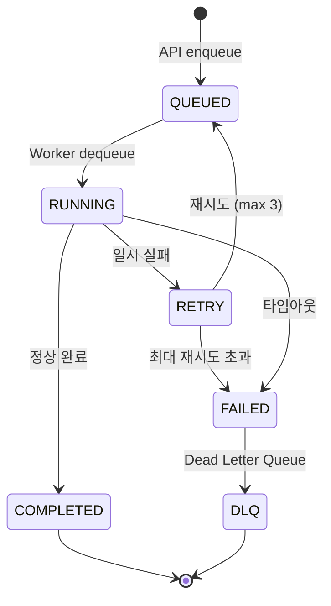
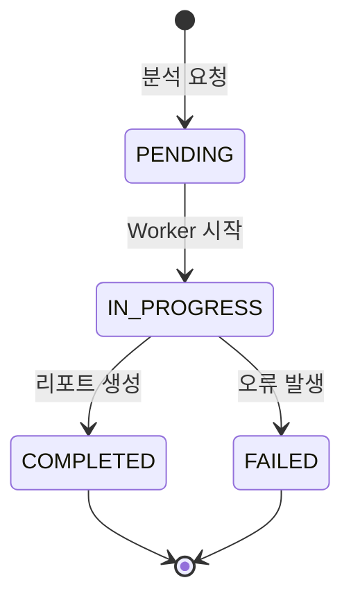

# RFC-003: Async Pipeline and Queue Architecture

| Field | Value |
|---|---|
| **RFC** | 003 |
| **Title** | Async Pipeline and Queue Architecture |
| **Author** | TBD |
| **Status** | 📝 Draft |
| **Created** | 2025-XX-XX |
| **Depends on** | RFC-001, RFC-002 |
| **Blocks** | — |

---

## Summary

스캔 요청의 비동기 처리 파이프라인을 정의한다. Message Queue 기술 선택, 작업 lifecycle, Worker scaling, Dead Letter Queue 정책, 백프레셔 처리를 다룬다.

---

## Motivation

- 스캔 작업은 수 분이 걸릴 수 있어 동기 처리 불가
- 동시 스캔 요청이 몰릴 때 Worker 과부하 방지 필요
- 실패한 작업의 재시도와 최종 실패 처리 정책이 없으면 작업 유실

---

## Proposal

### 기술 후보 비교

| 기준 | RabbitMQ | Redis (Bull/BullMQ) | AWS SQS |
|---|---|---|---|
| **프로토콜** | AMQP 0-9-1 | Redis Protocol | HTTPS |
| **메시지 보장** | At-least-once, At-most-once | At-least-once | At-least-once |
| **Priority Queue** | 지원 | 지원 | 미지원 (FIFO만) |
| **지연 메시지** | TTL + DLX | Delayed jobs 내장 | Delay 최대 15분 |
| **모니터링** | Management UI 내장 | Bull Board | CloudWatch |
| **운영 복잡도** | 중간 (Erlang 런타임) | 낮음 (Redis 재활용) | 낮음 (관리형) |
| **비용** | EC2 Docker (자체 호스팅) | EC2 Docker (자체 호스팅) | 요청당 과금 |
| **Self-hosted** | O | O | X (AWS 관리형) |

!!! question "TBD: 최종 선택 필요"
    - 이미 Redis를 캐시로 사용한다면 BullMQ로 통합이 효율적
    - 메시지 라우팅이 복잡해지면 RabbitMQ의 Exchange 패턴이 유리
    - AWS 의존도를 높여도 된다면 SQS가 운영 부담 최소

### 스캔 작업 Lifecycle

#### MQ 작업 상태 (Message Queue 관점)

#### 분석 상태 (Analysis DB 레코드 관점)

web-client의 Analysis 모델 상태와 MQ 작업 상태의 매핑:

### 상태 매핑

| MQ 작업 상태 | Analysis DB 상태 | 설명 |
|---|---|---|
| `QUEUED` | `PENDING` | 대기열에 등록됨 |
| `RUNNING` | `IN_PROGRESS` | 스캔/분석 진행 중 |
| `RETRY` | `IN_PROGRESS` | 재시도 중 (사용자에게는 진행 중으로 표시) |
| `COMPLETED` | `COMPLETED` | 리포트 생성 완료 |
| `FAILED` / `DLQ` | `FAILED` | 최종 실패 |

### MQ 작업 상태 상세

| 상태 | 설명 | 다음 상태 |
|---|---|---|
| `QUEUED` | MQ에 등록됨 | RUNNING |
| `RUNNING` | Worker가 작업 시작 (SAST/SCA/AI 분석 포함) | COMPLETED, RETRY, FAILED |
| `COMPLETED` | 리포트 생성 완료 | — |
| `RETRY` | 재시도 대기 | QUEUED (max 3), FAILED |
| `FAILED` | 최종 실패 | DLQ |
| `DLQ` | Dead Letter Queue 이동 | 수동 처리 |

!!! info "상태 단순화"
    초기 구현에서는 SCANNING, AI_REVIEW 등 세부 단계를 별도 상태로 관리하지 않고 `IN_PROGRESS` 내에서 내부적으로 처리한다. 필요 시 Analysis 모델에 `stage` 필드를 추가하여 세부 진행 상황을 추적할 수 있다.

### Dead Letter Queue 정책

| 조건 | DLQ 이동 |
|---|---|
| 재시도 3회 초과 | 즉시 |
| 작업 타임아웃 (10분) | 즉시 |
| 메시지 TTL 만료 (1시간) | 자동 |

DLQ의 메시지는 수동 검토 후 재처리하거나 폐기한다. resource-monitor가 DLQ 크기를 감시하고 임계치 초과 시 알림.

### Worker Scaling

| 메트릭 | 임계치 | 액션 |
|---|---|---|
| 큐 길이 > 10 | Scale up | Worker 컨테이너 추가 (max 5) |
| 큐 길이 < 2 (5분 유지) | Scale down | Worker 컨테이너 축소 (min 1) |
| Worker CPU > 80% | Scale up | 컨테이너 추가 |

!!! note "초기 단계"
    수동 scaling부터 시작하고, 트래픽 패턴 파악 후 자동 scaling 구현

---

## Alternatives

### Alt-1: Worker 없이 동기 처리

API Gateway에서 직접 스캔 수행. 구현 단순하나 HTTP 타임아웃(30s)에 걸림. **기각 사유**: 스캔이 수 분 소요.

### Alt-2: AWS Step Functions

서버리스 오케스트레이션. 상태 관리 자동화. **기각 사유**: AWS 의존도 높음, 디버깅 어려움, 비용 예측 곤란.

---

## Security Considerations

!!! warning "고려사항"
    - MQ 메시지에 소스코드 경로, 스캔 대상 정보 포함 — 메시지 암호화 또는 참조 ID만 전달
    - Worker가 외부 저장소에서 소스코드를 직접 pull — 접근 토큰 관리 필요
    - DLQ 메시지에 민감 정보 잔류 가능 — TTL 설정으로 자동 폐기

---

## Open Issues

| # | 이슈 | 결정 필요 시점 |
|---|---|---|
| 1 | MQ 기술 최종 선택 (RabbitMQ vs Redis vs SQS) | 개발 착수 전 |
| 2 | 우선순위 큐 필요 여부 (유료 사용자 우선) | 과금 모델 확정 후 |
| 3 | Worker 자동 scaling 구현 시점 | 베타 출시 후 |
| 4 | 메시지 페이로드 크기 제한 | 프로토타입 측정 후 |

---

## References

- [RabbitMQ Documentation](https://www.rabbitmq.com/docs)
- [BullMQ Documentation](https://docs.bullmq.io/)
- [RFC-002 Communication Protocol](rfc-002-communication-protocol.md)
