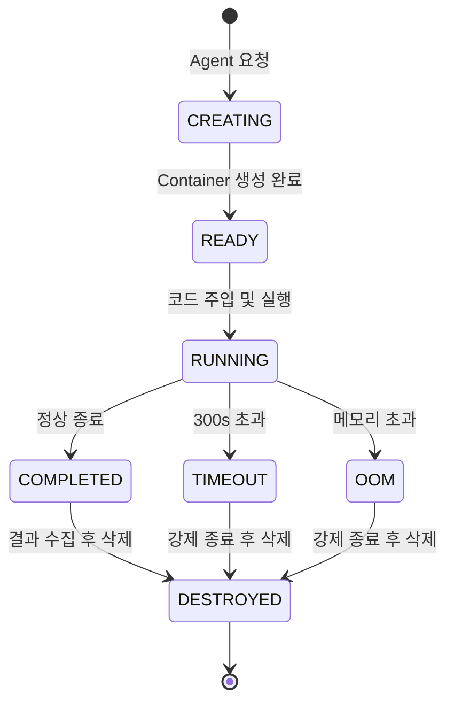

# RFC-004: AI Agent Sandbox Isolation

| Field | Value |
|---|---|
| **RFC** | 004 |
| **Title** | AI Agent Sandbox Isolation |
| **Author** | TBD |
| **Status** | 📝 Draft |
| **Created** | 2025-XX-XX |
| **Depends on** | RFC-001, RFC-002 |
| **Blocks** | — |

---

## Summary

runtime-agent가 익스플로잇 검증을 수행하는 sandbox(Docker-in-Docker)의 격리 정책, 리소스 제한, 모니터링 기준, 컨테이너 lifecycle을 정의한다.

---

## Motivation

- AI 에이전트가 자동 생성한 코드를 실행하므로 악의적 페이로드 실행 가능성 존재
- sandbox가 호스트 또는 같은 Private Subnet의 다른 서비스에 접근하면 보안 사고
- 리소스 제한 없이 실행하면 단일 작업이 전체 인프라 리소스를 소진할 수 있음

---

## Proposal

### 격리 모델: Defense in Depth

```
┌─────────────────────────────────────────┐
│  EC2 Host                               │
│  ┌───────────────────────────────────┐  │
│  │  runtime-agent Container          │  │
│  │  ┌─────────────────────────────┐  │  │
│  │  │  Sandbox (Docker-in-Docker) │  │  │
│  │  │  ┌───────────────────────┐  │  │  │
│  │  │  │  User Code Execution  │  │  │  │
│  │  │  └───────────────────────┘  │  │  │
│  │  └─────────────────────────────┘  │  │
│  └───────────────────────────────────┘  │
└─────────────────────────────────────────┘
```

| 격리 계층 | 메커니즘 | 방어 대상 |
|---|---|---|
| **L1: Network** | sg-sandbox: DENY ALL outbound | 외부 접근 차단 |
| **L2: Container** | Docker-in-Docker, seccomp, no-new-privileges | 호스트 탈출 방지 |
| **L3: Resource** | cgroup 제한 (CPU, RAM, Storage, PID) | 리소스 소진 방지 |
| **L4: Filesystem** | Read-only root, tmpfs /tmp, no volume mounts | 호스트 파일 접근 차단 |
| **L5: Time** | 실행 타임아웃 (max 300s) | 무한 실행 방지 |

### 리소스 제한

| Resource | Limit | 근거 |
|---|---|---|
| **RAM** | 4 GB | 일반적 빌드/테스트 실행에 충분 |
| **CPU** | 2 vCPU (CFS quota) | 호스트 다른 서비스에 영향 방지 |
| **Storage** | 10 GB (tmpfs) | 대형 빌드 아티팩트 수용 |
| **PID** | max 256 | Fork bomb 방지 |
| **Execution time** | 300s | 무한 루프 방지 |
| **Network** | DENY ALL | 외부 접근 완전 차단 |

### Sandbox Lifecycle



| 상태 | 설명 | 소요 시간 |
|---|---|---|
| `CREATING` | Docker 컨테이너 생성, 리소스 제한 적용 | 2-5s |
| `READY` | 실행 대기 | 즉시 |
| `RUNNING` | 코드 실행 중 | max 300s |
| `COMPLETED` | 정상 종료, stdout/stderr 수집 | 즉시 |
| `TIMEOUT` | 시간 초과 강제 종료 | 즉시 |
| `OOM` | 메모리 초과 강제 종료 | 즉시 |
| `DESTROYED` | 컨테이너 및 tmpfs 삭제 | 1-2s |

!!! danger "핵심 원칙"
    sandbox 컨테이너는 **1회용**이다. 작업 완료 후 반드시 삭제하고, 재사용하지 않는다.

### Docker 실행 옵션

```bash
docker run \
  --rm \
  --network none \
  --memory 4g \
  --cpus 2 \
  --pids-limit 256 \
  --read-only \
  --tmpfs /tmp:size=10g \
  --security-opt no-new-privileges \
  --security-opt seccomp=killhouse-seccomp.json \
  killhouse/sandbox:latest \
  timeout 300 /entrypoint.sh
```

### Resource Monitor 연동

resource-monitor는 sandbox 상태를 주기적으로 점검한다.

| 메트릭 | 수집 방법 | 임계치 | 액션 |
|---|---|---|---|
| Container count | Docker API | > 5 동시 실행 | 신규 생성 대기열 |
| RAM usage | Docker stats | > 3.5 GB (87%) | 경고 로그 |
| Execution time | 시작 시간 기록 | > 300s | 강제 종료 |
| Orphan containers | 5분 주기 점검 | 상태 없는 컨테이너 | 강제 삭제 |

---

## Alternatives

### Alt-1: gVisor (runsc)

Docker 대신 gVisor 런타임 사용. 시스템 콜 레벨에서 격리하여 보안 강화. **보류 사유**: 일부 바이너리 호환성 문제, 디버깅 복잡도 증가. 보안 요구사항 상향 시 재검토.

### Alt-2: Firecracker MicroVM

AWS Firecracker로 MicroVM 단위 격리. 가장 강력한 격리이나 운영 복잡도 높음. **기각 사유**: 초기 단계에 과도한 복잡도.

### Alt-3: 원격 실행 서비스 (Judge0 등)

외부 코드 실행 서비스 사용. 운영 부담 최소화. **기각 사유**: 소스코드 외부 유출 위험, 레이턴시, 비용.

---

## Security Considerations

!!! warning "위협 모델"
    - **컨테이너 탈출**: seccomp + no-new-privileges + read-only root로 완화. gVisor로 추가 강화 가능.
    - **네트워크 공격**: `--network none`으로 완전 차단
    - **리소스 소진 (DoS)**: cgroup 제한 + PID 제한 + 타임아웃
    - **민감 정보 잔류**: 1회용 컨테이너 + tmpfs (디스크 미기록)
    - **악의적 출력**: stdout/stderr 크기 제한 (max 1MB) 후 Agent에 전달

---

## Open Issues

| # | 이슈 | 결정 필요 시점 |
|---|---|---|
| 1 | seccomp 프로파일 세부 정책 (허용 syscall 목록) | 프로토타입 테스트 후 |
| 2 | sandbox 기본 이미지에 포함할 도구 (gcc, python, node 등) | 지원 언어 확정 후 |
| 3 | gVisor 도입 시점 | 보안 감사 후 |
| 4 | 동시 sandbox 최대 수 (호스트 리소스 기준) | EC2 인스턴스 스펙 확정 후 |
| 5 | sandbox 내부 출력 로깅 정책 (보관 기간, 범위) | 컴플라이언스 요구사항 확인 후 |

---

## References

- [Docker Security Best Practices](https://docs.docker.com/engine/security/)
- [seccomp Security Profiles](https://docs.docker.com/engine/security/seccomp/)
- [gVisor Documentation](https://gvisor.dev/docs/)
- [RFC-001 Network Topology](rfc-001-network-topology.md) — sg-sandbox 규칙
