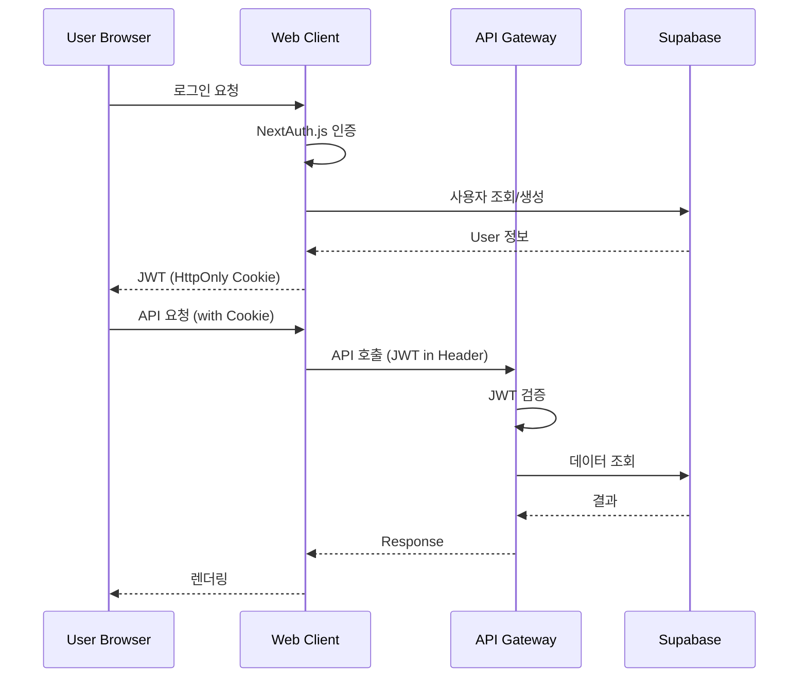
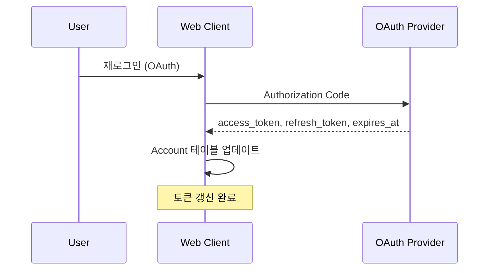

# RFC-005: Authentication and Authorization

| Field | Value |
|---|---|
| **RFC** | 005 |
| **Title** | Authentication and Authorization |
| **Author** | TBD |
| **Status** | 📝 Draft |
| **Created** | 2025-XX-XX |
| **Depends on** | RFC-001, RFC-002 |
| **Blocks** | — |

---

## Summary

KILLHOUSE 플랫폼의 사용자 인증, 세션 관리, 서비스 간 인증, 권한 체계를 정의한다. Web Client의 NextAuth.js 기반 인증과 API Gateway의 JWT 검증, 내부 서비스 간 인증 방식을 다룬다.

---

## Motivation

- 사용자 인증 없이는 구독 기반 과금 및 프로젝트 소유권 관리 불가
- API Gateway가 JWT를 검증하지 않으면 무인가 접근 가능
- 서비스 간 인증이 없으면 내부 API 위조 호출 가능
- OAuth 토큰 관리 정책이 없으면 GitHub/GitLab 저장소 접근 권한 만료 시 서비스 장애

---

## Proposal

### 인증 제공자

| Provider | 용도 | Scope |
|---|---|---|
| **Credentials** | 이메일/비밀번호 로그인 | — |
| **Google OAuth** | 소셜 로그인 | email, profile |
| **GitHub OAuth** | 소셜 로그인 + 저장소 접근 | read:user, user:email, repo |
| **GitLab OAuth** | 소셜 로그인 + 저장소 접근 | read_api, read_user, read_repository |

### 인증 아키텍처



### JWT 구조

```typescript
interface JWTPayload {
  sub: string;        // User ID
  email: string;
  name: string;
  picture?: string;
  iat: number;        // Issued At
  exp: number;        // Expiration (24h)
}
```

| 필드 | 설명 | 만료 |
|---|---|---|
| **Access Token** | API 요청 인증 | 24시간 |
| **Session** | NextAuth.js 세션 | 30일 (sliding) |

### 비밀번호 정책

| 항목 | 요구사항 |
|---|---|
| **최소 길이** | 8자 |
| **복잡도** | 대문자 + 소문자 + 숫자 필수 |
| **해싱** | bcryptjs, 12 rounds |
| **저장** | Supabase PostgreSQL (password 필드) |

### OAuth 토큰 관리



| 이벤트 | 처리 |
|---|---|
| **OAuth 로그인** | access_token, refresh_token, expires_at 저장 |
| **OAuth 재로그인** | 토큰 갱신 (기존 토큰 덮어쓰기) |
| **토큰 만료** | 저장소 API 호출 실패 → 사용자에게 재연결 요청 |
| **연결 해제** | Account 레코드 삭제, 연결된 Repository 비활성화 |

!!! warning "토큰 만료 처리"
    GitHub/GitLab 토큰 만료 시 자동 갱신하지 않고, 사용자에게 재연결을 요청한다. refresh_token 자동 갱신은 복잡도가 높아 초기 버전에서는 제외.

### 서비스 간 인증

| 구간 | 방식 | 근거 |
|---|---|---|
| Web Client → API Gateway | JWT (Authorization: Bearer) | 사용자 컨텍스트 전달 |
| API Gateway → Message Queue | 신뢰 (VPC 내부) | sg-private에서만 접근 가능 |
| Scanner → Agent | 신뢰 (VPC 내부) | gRPC, 직접 연결 |
| Agent → OpenAI | API Key (환경변수) | OpenAI 표준 |
| All → Supabase | Connection String (환경변수) | 데이터베이스 표준 |

!!! note "VPC 내부 신뢰"
    Private Subnet 내부 통신은 Security Group으로 격리되므로 별도 인증 없이 신뢰한다. mTLS 적용 여부는 RFC-001 Open Issue #2에서 결정.

### 권한 체계

현재 버전에서는 단순한 소유권 기반 권한만 적용한다.

| 리소스 | 권한 규칙 |
|---|---|
| **Project** | 소유자(userId)만 접근 가능 |
| **Repository** | 프로젝트 소유자만 접근 가능 |
| **Analysis** | 프로젝트 소유자만 접근 가능 |
| **Subscription** | 본인 구독만 조회/변경 가능 |
| **Payment** | 본인 결제 내역만 조회 가능 |

!!! question "TBD: 팀/조직 기능"
    팀 기반 접근 제어(RBAC)는 Enterprise 플랜 기능으로 추후 RFC에서 다룬다.

### 세션 관리

| 설정 | 값 | 근거 |
|---|---|---|
| **Strategy** | JWT | 서버리스 호환, 상태 비저장 |
| **Session 만료** | 30일 | UX 편의성 |
| **Sliding Session** | 활성화 | 활동 시 자동 연장 |
| **Cookie** | HttpOnly, Secure, SameSite=Lax | XSS/CSRF 방어 |

### API 미들웨어 체인

```typescript
// 인증 미들웨어 체인
const authenticatedHandler = withMiddleware(
  withErrorHandling,
  withAuth  // JWT 검증, userId 주입
);

// 구독 제한 체크 포함
const projectCreationHandler = withMiddleware(
  withErrorHandling,
  withAuth,
  withSubscriptionCheck('createProject')
);
```

### 에러 응답

| HTTP Status | 코드 | 설명 |
|---|---|---|
| 401 | `UNAUTHORIZED` | 인증 필요 (토큰 없음/만료) |
| 403 | `FORBIDDEN` | 권한 없음 (다른 사용자 리소스) |
| 403 | `LIMIT_EXCEEDED` | 구독 제한 초과 |

```json
{
  "success": false,
  "error": "구독 제한을 초과했습니다",
  "code": "LIMIT_EXCEEDED",
  "usage": {
    "current": 3,
    "limit": 3
  }
}
```

---

## Alternatives

### Alt-1: 자체 JWT 발급 (NextAuth 미사용)

API Gateway에서 직접 JWT 발급. 세밀한 제어 가능하나 OAuth 통합, 세션 관리를 직접 구현해야 함. **기각 사유**: NextAuth.js의 성숙한 생태계 활용.

### Alt-2: Supabase Auth

Supabase 내장 인증 사용. 설정 간편하나 NextAuth.js 대비 OAuth 제공자 커스터마이징 제한. **기각 사유**: GitHub/GitLab repo scope 세밀한 제어 필요.

### Alt-3: 서비스 간 mTLS

모든 내부 통신에 mTLS 적용. 보안 강화되나 인증서 관리 복잡도 증가. **보류**: 보안 감사 요구사항에 따라 재검토.

---

## Security Considerations

!!! warning "고려사항"
    - **JWT 탈취**: HttpOnly Cookie로 XSS 방어, 짧은 만료 시간(24h)으로 피해 최소화
    - **CSRF**: SameSite=Lax Cookie 설정, API는 Authorization 헤더 필수
    - **OAuth 토큰 노출**: DB 암호화 저장 검토 (현재 평문)
    - **비밀번호 브루트포스**: Rate limiting 적용 (RFC-007에서 정의)
    - **세션 고정 공격**: 로그인 시 새 세션 ID 발급

---

## Open Issues

| # | 이슈 | 결정 필요 시점 |
|---|---|---|
| 1 | OAuth 토큰 DB 암호화 여부 | 보안 감사 전 |
| 2 | refresh_token 자동 갱신 구현 여부 | 베타 피드백 후 |
| 3 | 팀/조직 기반 RBAC 설계 | Enterprise 플랜 개발 시 |
| 4 | 2FA (이중 인증) 지원 | 보안 요구사항 확정 후 |
| 5 | API Key 기반 인증 (CI/CD 용) | API 공개 시 |

---

## References

- [NextAuth.js Documentation](https://next-auth.js.org/)
- [JWT Best Practices](https://datatracker.ietf.org/doc/html/rfc8725)
- [OWASP Authentication Cheat Sheet](https://cheatsheetseries.owasp.org/cheatsheets/Authentication_Cheat_Sheet.html)
- [RFC-001 Network Topology](rfc-001-network-topology.md)
- [RFC-002 Communication Protocol](rfc-002-communication-protocol.md)
