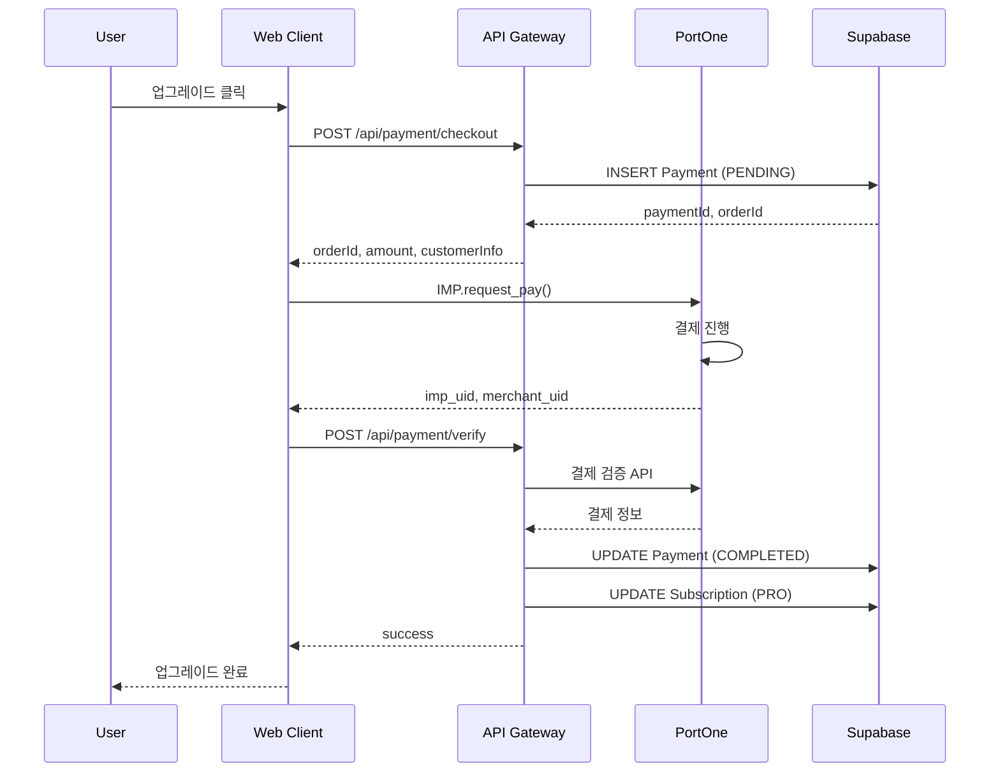
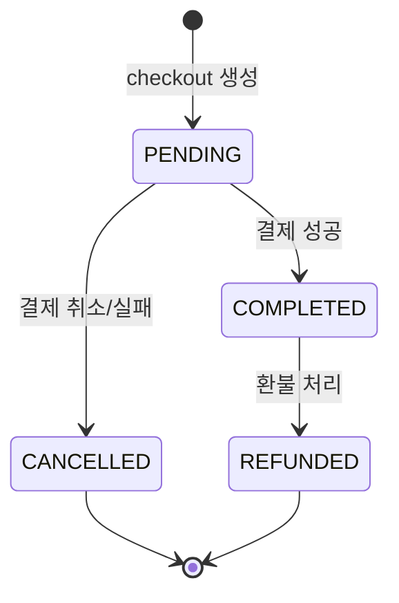
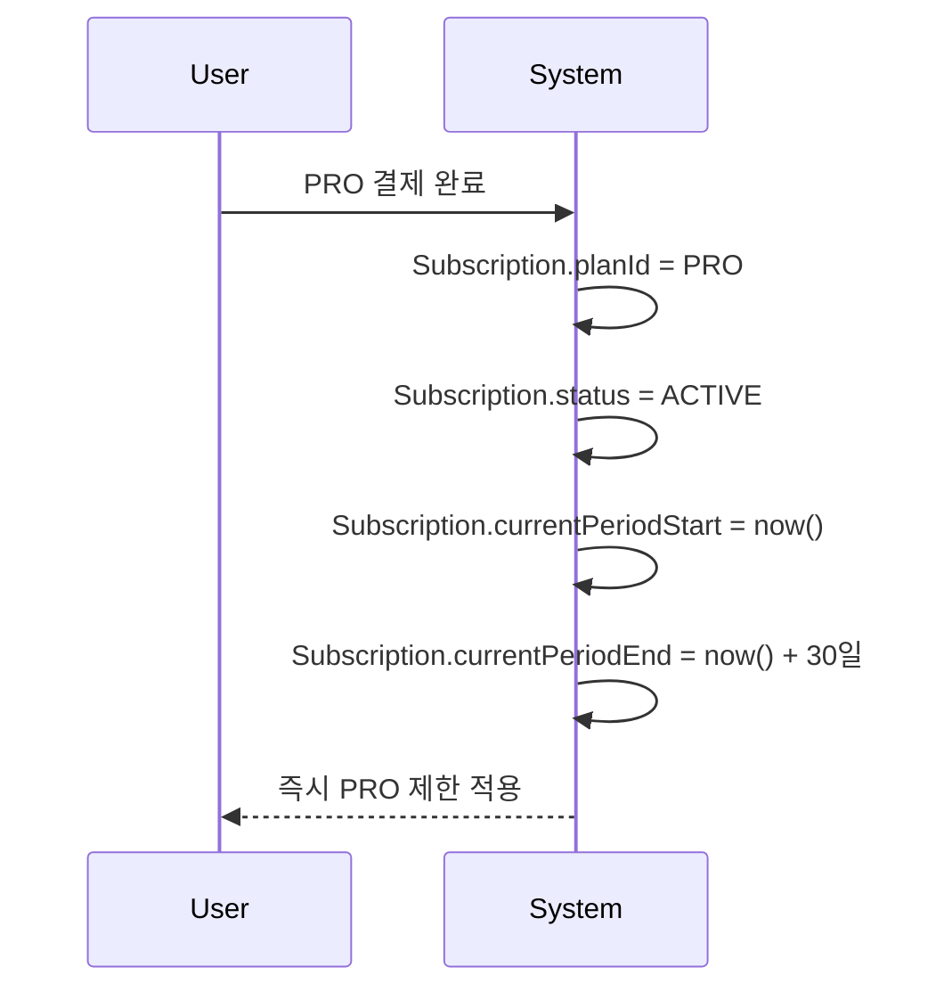
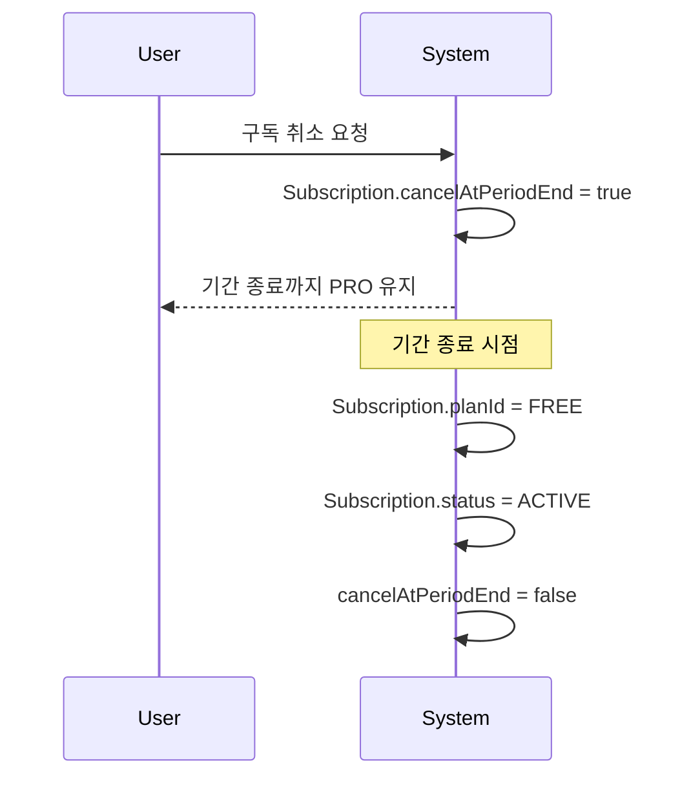
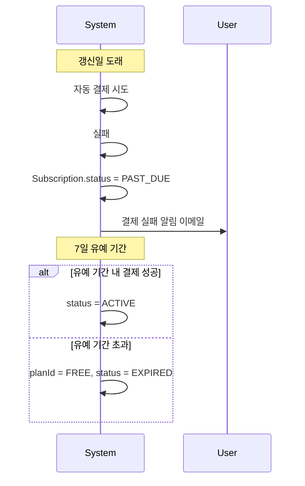

# RFC-006: Billing and Subscription

| Field | Value |
|---|---|
| **RFC** | 006 |
| **Title** | Billing and Subscription |
| **Author** | TBD |
| **Status** | 📝 Draft |
| **Created** | 2025-XX-XX |
| **Depends on** | RFC-005 |
| **Blocks** | — |

---

## Summary

KILLHOUSE 플랫폼의 구독 티어, 사용량 제한, 결제 흐름, 구독 상태 관리, 환불 정책을 정의한다. PortOne V1 (아임포트)을 결제 게이트웨이로 사용한다.

---

## Motivation

- 구독 기반 SaaS 모델로 지속 가능한 수익 구조 필요
- 무료 티어 제한 없이는 리소스 남용 위험
- 결제 흐름이 명확하지 않으면 결제 실패, 이중 결제 등 사고 발생
- 구독 상태 변경 시나리오(업그레이드/다운그레이드/취소)가 정의되지 않으면 고객 불만

---

## Proposal

### 구독 티어

| Plan | 월 요금 (KRW) | 프로젝트 | 분석/월 | 저장 용량 | 대상 |
|---|---|---|---|---|---|
| **FREE** | 0 | 3개 | 10회 | 100 MB | 개인/평가용 |
| **PRO** | 29,000 | 무제한 | 100회 | 10 GB | 소규모 팀 |
| **ENTERPRISE** | 별도 협의 | 무제한 | 무제한 | 무제한 | 대규모 조직 |

!!! note "테스트 가격"
    개발/테스트 환경에서는 PRO 플랜을 1원으로 설정하여 실제 결제 흐름 테스트.

### 제한 적용 로직

```typescript
interface SubscriptionLimits {
  maxProjects: number;      // -1 = 무제한
  maxAnalysesPerMonth: number;
  maxStorageBytes: number;
}

const PLAN_LIMITS: Record<PlanId, SubscriptionLimits> = {
  FREE: { maxProjects: 3, maxAnalysesPerMonth: 10, maxStorageBytes: 100 * MB },
  PRO: { maxProjects: -1, maxAnalysesPerMonth: 100, maxStorageBytes: 10 * GB },
  ENTERPRISE: { maxProjects: -1, maxAnalysesPerMonth: -1, maxStorageBytes: -1 },
};
```

| 액션 | 체크 함수 | 실패 시 |
|---|---|---|
| 프로젝트 생성 | `canCreateProject()` | 403 LIMIT_EXCEEDED |
| 분석 실행 | `canRunAnalysis()` | 403 LIMIT_EXCEEDED |
| 파일 업로드 | `canUploadFile(size)` | 403 LIMIT_EXCEEDED |

### 사용량 추적

| 메트릭 | 집계 방식 | 리셋 주기 |
|---|---|---|
| 프로젝트 수 | COUNT(projects WHERE status != DELETED) | — |
| 월간 분석 횟수 | COUNT(analyses WHERE createdAt >= 월초) | 매월 1일 00:00 UTC |
| 저장 용량 | SUM(repository.size + analysis.reportSize) | — |

### 결제 흐름



### 결제 상태



| 상태 | 설명 | 다음 상태 |
|---|---|---|
| `PENDING` | 결제 대기 중 | COMPLETED, CANCELLED |
| `COMPLETED` | 결제 완료 | REFUNDED |
| `CANCELLED` | 결제 취소/실패 | — |
| `REFUNDED` | 환불 완료 | — |

### 구독 상태

| 상태 | 설명 | 제한 적용 |
|---|---|---|
| `ACTIVE` | 정상 구독 | 해당 플랜 제한 |
| `CANCELLED` | 취소 예정 (기간 종료까지 유효) | 해당 플랜 제한 |
| `EXPIRED` | 만료됨 | FREE 플랜 제한 |
| `PAST_DUE` | 결제 실패 (유예 기간) | 해당 플랜 제한 |

### 구독 변경 시나리오

#### 업그레이드 (FREE → PRO)



#### 다운그레이드 (PRO → FREE)



!!! warning "프로젝트 초과 처리"
    다운그레이드 후 FREE 제한(3개)을 초과하는 프로젝트가 있으면:
    - 기존 프로젝트는 유지 (읽기 전용)
    - 새 프로젝트 생성 불가
    - 새 분석 실행 불가

#### 갱신 실패



### 환불 정책

| 조건 | 환불 금액 | 비고 |
|---|---|---|
| 결제 후 7일 이내 | 전액 | 사용량 무관 |
| 결제 후 7일 초과 | 불가 | 일할 환불 미지원 |
| 서비스 장애 | 전액 | 고객센터 문의 |

### Webhook 처리

PortOne에서 서버로 직접 호출하는 webhook 처리.

| 이벤트 | 처리 |
|---|---|
| `payment.paid` | Payment.status = COMPLETED, Subscription 업데이트 |
| `payment.failed` | Payment.status = CANCELLED, 사용자 알림 |
| `payment.cancelled` | 환불 처리, Subscription 유지 |

```typescript
// Webhook payload 검증
interface PortOneWebhook {
  type: 'payment.paid' | 'payment.failed' | 'payment.cancelled';
  paymentId: string;
  transactionId: string;
  timestamp: string;
}
```

### API 엔드포인트

| Method | Path | 설명 |
|---|---|---|
| POST | `/api/payment/checkout` | 결제 준비 (orderId 발급) |
| POST | `/api/payment/verify` | 결제 검증 및 완료 |
| GET | `/api/payment/history` | 결제 내역 조회 |
| POST | `/api/payment/refund` | 환불 요청 |
| POST | `/api/payment/webhook` | PortOne 서버 콜백 |
| GET | `/api/subscription` | 현재 구독 정보 |
| POST | `/api/subscription/cancel` | 구독 취소 (기간 종료 시) |
| GET | `/api/subscription/usage` | 사용량 통계 |

### 데이터 모델

```prisma
model Subscription {
  id                  String   @id @default(cuid())
  userId              String   @unique
  planId              String   // FREE, PRO, ENTERPRISE
  status              String   // ACTIVE, CANCELLED, EXPIRED, PAST_DUE
  currentPeriodStart  DateTime
  currentPeriodEnd    DateTime
  cancelAtPeriodEnd   Boolean  @default(false)
  portoneCustomerId   String?
  stripeCustomerId    String?  // 해외 결제 대비
  createdAt           DateTime @default(now())
  updatedAt           DateTime @updatedAt
}

model Payment {
  id              String    @id @default(cuid())
  userId          String
  orderId         String    @unique
  planId          String
  amount          Int       // KRW
  status          String    // PENDING, COMPLETED, CANCELLED, REFUNDED
  portonePaymentId String?
  transactionId   String?
  paidAt          DateTime?
  cancelledAt     DateTime?
  createdAt       DateTime  @default(now())
  updatedAt       DateTime  @updatedAt
}
```

---

## Alternatives

### Alt-1: Stripe 단독 사용

글로벌 표준 결제 시스템. 한국 카드 결제 지원하나 수수료 높음 (3.5%+). **보류**: 해외 진출 시 Stripe 병행 검토.

### Alt-2: 사용량 기반 과금

분석 횟수당 과금. 예측 가능한 비용 제공하나 사용자 경험 복잡. **기각 사유**: 초기 단계에서 단순한 티어 기반 선호.

### Alt-3: 연간 구독

연간 결제 시 할인. 현금 흐름 개선. **추후 추가**: PRO 플랜 안정화 후 연간 옵션 추가.

---

## Security Considerations

!!! warning "고려사항"
    - **결제 정보 저장 금지**: 카드 정보는 PortOne에서만 관리, 서버에 저장 안 함
    - **Webhook 검증**: PortOne 서명 검증으로 위조 방지
    - **이중 결제 방지**: orderId 유니크 제약, idempotency 처리
    - **권한 검증**: 본인 결제 내역만 조회 가능
    - **금액 검증**: 서버에서 플랜 가격 재확인 (클라이언트 금액 신뢰 안 함)

---

## Open Issues

| # | 이슈 | 결정 필요 시점 |
|---|---|---|
| 1 | 연간 구독 할인율 | PRO 플랜 런칭 후 |
| 2 | Enterprise 플랜 가격 정책 | 영업 시작 전 |
| 3 | 자동 갱신 vs 수동 갱신 | 베타 피드백 후 |
| 4 | 일할 환불 정책 필요 여부 | 법률 검토 후 |
| 5 | 해외 결제 (Stripe) 통합 시점 | 해외 진출 계획 시 |
| 6 | 쿠폰/프로모션 코드 시스템 | 마케팅 전략 확정 후 |

---

## References

- [PortOne Documentation](https://developers.portone.io/)
- [SaaS Pricing Models](https://www.priceintelligently.com/blog/saas-pricing-models)
- [RFC-005 Authentication](rfc-005-authentication.md)
