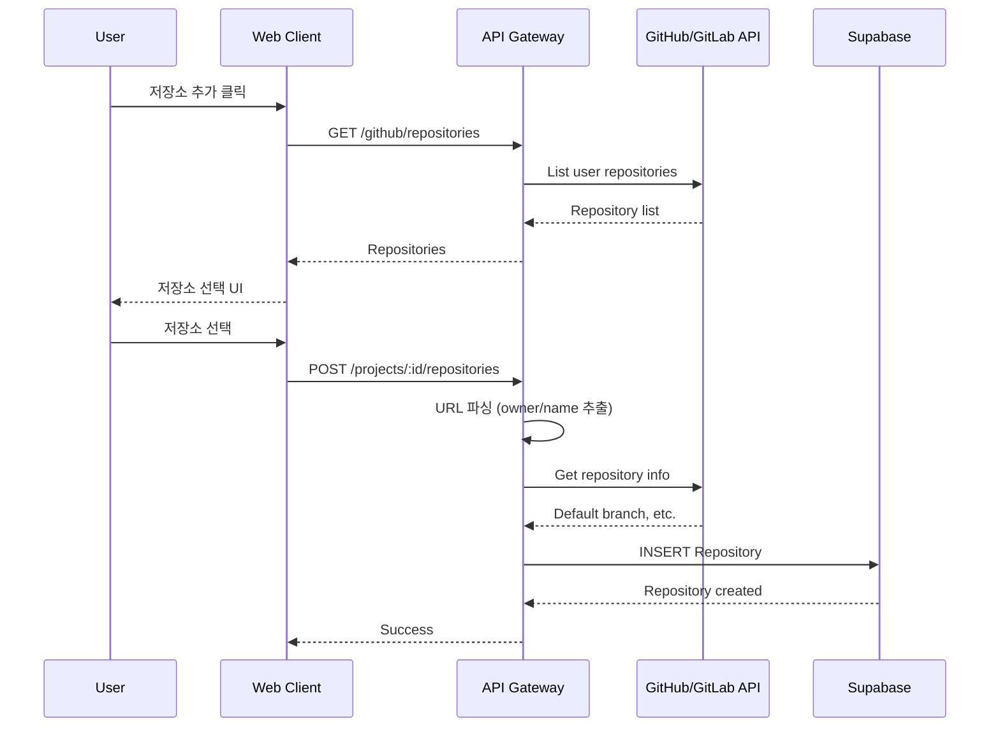
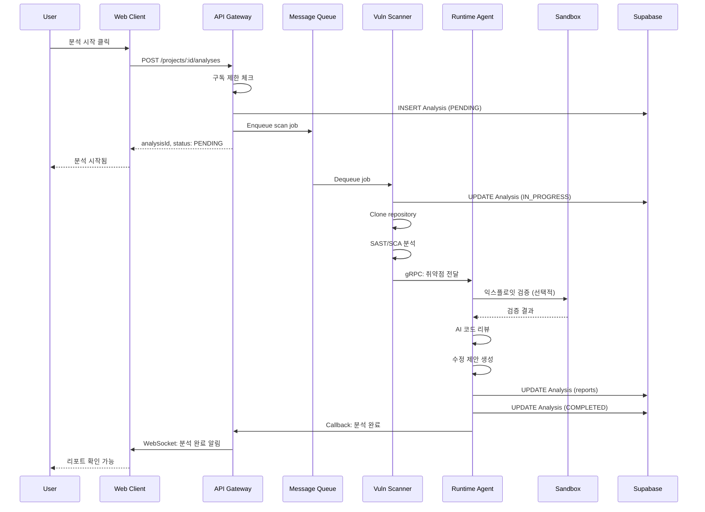
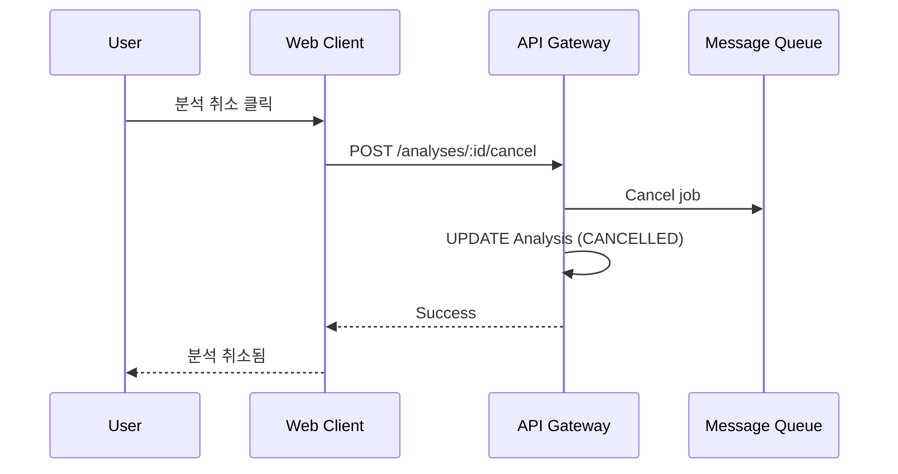

# RFC-008: Project and Analysis Workflow

| Field | Value |
|---|---|
| **RFC** | 008 |
| **Title** | Project and Analysis Workflow |
| **Author** | TBD |
| **Status** | 📝 Draft |
| **Created** | 2025-XX-XX |
| **Depends on** | RFC-003, RFC-005, RFC-006 |
| **Blocks** | — |

---

## Summary

KILLHOUSE 플랫폼의 프로젝트 관리, 저장소 연결, 분석 실행 워크플로우를 정의한다. 다중 저장소 지원, 브랜치 선택, 분석 리포트 생성 과정을 다룬다.

---

## Motivation

- 프로젝트-저장소 관계가 명확하지 않으면 분석 대상 코드 관리 혼란
- 저장소 접근 권한, 동기화 방식이 정의되지 않으면 연동 오류 발생
- 분석 워크플로우가 명확하지 않으면 사용자가 진행 상황 파악 불가

---

## Proposal

### 프로젝트 구조

```
Project
├── name: "My Security Project"
├── description: "..."
├── status: ACTIVE | ARCHIVED | DELETED
├── userId: "user_abc123"
├── repositories[]
│   ├── Repository (Primary)
│   │   ├── provider: GITHUB | GITLAB | MANUAL
│   │   ├── url: "https://github.com/owner/repo"
│   │   ├── owner: "owner"
│   │   ├── name: "repo"
│   │   ├── defaultBranch: "main"
│   │   └── isPrimary: true
│   └── Repository
│       ├── provider: GITLAB
│       └── ...
└── analyses[]
    ├── Analysis
    │   ├── status: PENDING | IN_PROGRESS | COMPLETED | FAILED
    │   ├── repositoryId: "..."
    │   ├── branch: "main"
    │   ├── commitHash: "abc123..."
    │   └── reports...
    └── ...
```

### 저장소 제공자

| Provider | 설명 | 인증 방식 |
|---|---|---|
| **GITHUB** | GitHub 저장소 연결 | OAuth (repo scope) |
| **GITLAB** | GitLab 저장소 연결 | OAuth (read_repository scope) |
| **MANUAL** | 수동 코드 업로드 | — |

### 저장소 연결 흐름



### URL 파싱 규칙

| Provider | URL 패턴 | 추출 |
|---|---|---|
| GitHub | `https://github.com/{owner}/{name}` | owner, name |
| GitLab | `https://gitlab.com/{owner}/{name}` | owner, name |
| GitLab (그룹) | `https://gitlab.com/{group}/{subgroup}/{name}` | group/subgroup, name |

### Primary 저장소

- 프로젝트당 하나의 Primary 저장소 지정
- Primary는 대시보드에서 기본 표시되는 저장소
- Primary 삭제 시 다음 저장소가 자동으로 Primary 승격
- 모든 저장소 삭제 시 프로젝트는 저장소 없는 상태로 유지

### 분석 워크플로우



### 분석 상태

| 상태 | 설명 | 사용자 액션 |
|---|---|---|
| `PENDING` | 대기열에 등록됨 | 대기 |
| `IN_PROGRESS` | 분석 진행 중 | 진행률 확인 |
| `COMPLETED` | 분석 완료 | 리포트 확인 |
| `FAILED` | 분석 실패 | 재시도 또는 오류 확인 |

### 분석 요청 파라미터

```typescript
interface AnalysisRequest {
  repositoryId: string;     // 분석 대상 저장소
  branch: string;           // 분석 대상 브랜치 (default: defaultBranch)
  commitHash?: string;      // 특정 커밋 (optional, default: HEAD)
  scanTypes?: ScanType[];   // 스캔 유형 (default: all)
}

type ScanType = 'SAST' | 'SCA' | 'CONTAINER' | 'IAC';
```

### 분석 리포트 구조

```typescript
interface AnalysisReport {
  id: string;
  projectId: string;
  repositoryId: string;
  branch: string;
  commitHash: string;
  status: AnalysisStatus;

  // 취약점 요약
  vulnerabilitiesFound: number;
  criticalCount: number;
  highCount: number;
  mediumCount: number;
  lowCount: number;
  infoCount: number;

  // 상세 리포트
  staticAnalysisReport: string;      // SAST 결과 (JSON string)
  penetrationTestReport: string;     // 침투 테스트 결과 (JSON string)

  // 샌드박스 정보
  sandboxContainerId?: string;
  sandboxStatus?: SandboxStatus;

  // 타임스탬프
  startedAt: DateTime;
  completedAt?: DateTime;
}
```

### 취약점 심각도

| Level | Score (CVSS) | 설명 | 예시 |
|---|---|---|---|
| **CRITICAL** | 9.0 - 10.0 | 즉각적인 조치 필요 | RCE, 인증 우회 |
| **HIGH** | 7.0 - 8.9 | 빠른 조치 필요 | SQL Injection, XSS |
| **MEDIUM** | 4.0 - 6.9 | 계획된 조치 필요 | 정보 노출, CSRF |
| **LOW** | 0.1 - 3.9 | 낮은 우선순위 | 설정 미흡 |
| **INFO** | 0.0 | 참고 정보 | Best practice 권고 |

### 코드 클론 방식

| 방식 | 설명 | 사용 시점 |
|---|---|---|
| **Shallow Clone** | `git clone --depth 1` | 기본 (최신 커밋만) |
| **Full Clone** | `git clone` | 히스토리 분석 필요 시 |
| **Archive Download** | ZIP/tarball | 대용량 저장소 |

!!! note "클론 최적화"
    기본적으로 shallow clone을 사용하여 네트워크 대역폭과 스토리지를 절약한다. 특정 커밋 분석 요청 시에만 해당 depth까지 fetch.

### 저장소 동기화

| 이벤트 | 처리 |
|---|---|
| 분석 시작 | 최신 코드 fetch |
| 브랜치 변경 | 해당 브랜치 checkout |
| 저장소 삭제 | 로컬 캐시 정리 |
| OAuth 토큰 만료 | 분석 실패, 사용자 알림 |

### 동시 분석 제한

| 플랜 | 동시 분석 수 | 대기열 최대 |
|---|---|---|
| **FREE** | 1 | 3 |
| **PRO** | 3 | 10 |
| **ENTERPRISE** | 10 | 무제한 |

### 분석 타임아웃

| 단계 | 타임아웃 | 초과 시 |
|---|---|---|
| 저장소 클론 | 5분 | FAILED |
| SAST 분석 | 10분 | FAILED |
| SCA 분석 | 5분 | FAILED |
| AI 리뷰 | 10분 | 기본 결과 사용 |
| 샌드박스 실행 | 5분 | 검증 생략 |
| **전체** | 30분 | FAILED |

### 분석 재시도 정책

| 조건 | 재시도 | 비고 |
|---|---|---|
| 네트워크 오류 (clone) | 3회 | exponential backoff |
| API 오류 (GitHub/GitLab) | 2회 | 60초 대기 |
| AI 서비스 오류 | 2회 | fallback 결과 사용 |
| 샌드박스 타임아웃 | 0회 | 즉시 실패 처리 |
| 사용자 취소 | — | 즉시 중단 |

### 분석 취소

사용자가 진행 중인 분석을 취소할 수 있다.



### 데이터 모델

```prisma
model Project {
  id          String       @id @default(cuid())
  name        String
  description String?
  status      ProjectStatus @default(ACTIVE)
  userId      String
  createdAt   DateTime     @default(now())
  updatedAt   DateTime     @updatedAt

  user         User         @relation(fields: [userId], references: [id])
  repositories Repository[]
  analyses     Analysis[]
}

model Repository {
  id            String   @id @default(cuid())
  projectId     String
  provider      Provider // GITHUB, GITLAB, MANUAL
  url           String
  owner         String
  name          String
  defaultBranch String   @default("main")
  isPrimary     Boolean  @default(false)
  createdAt     DateTime @default(now())
  updatedAt     DateTime @updatedAt

  project  Project    @relation(fields: [projectId], references: [id])
  analyses Analysis[]
}

model Analysis {
  id           String         @id @default(cuid())
  projectId    String
  repositoryId String
  status       AnalysisStatus @default(PENDING)
  branch       String
  commitHash   String?

  // 취약점 카운트
  vulnerabilitiesFound Int @default(0)
  criticalCount        Int @default(0)
  highCount            Int @default(0)
  mediumCount          Int @default(0)
  lowCount             Int @default(0)

  // 리포트
  staticAnalysisReport    String?
  penetrationTestReport   String?

  // 샌드박스
  sandboxContainerId String?
  sandboxStatus      String?

  // 타임스탬프
  startedAt   DateTime?
  completedAt DateTime?
  createdAt   DateTime  @default(now())
  updatedAt   DateTime  @updatedAt

  project    Project    @relation(fields: [projectId], references: [id])
  repository Repository @relation(fields: [repositoryId], references: [id])
}
```

---

## Alternatives

### Alt-1: 단일 저장소만 지원

프로젝트당 하나의 저장소만 연결. 구현 단순화. **기각 사유**: 모노레포, 프론트/백 분리 프로젝트 지원 불가.

### Alt-2: Webhook 기반 자동 분석

저장소 push 시 자동 분석 트리거. CI/CD 통합. **추후 추가**: 베타 이후 GitHub Actions 연동 검토.

### Alt-3: 분석 결과 캐싱

동일 커밋 재분석 시 캐시 결과 반환. 리소스 절약. **추후 추가**: 결과 일관성 검증 후 도입.

---

## Security Considerations

!!! warning "고려사항"
    - **저장소 접근 권한**: OAuth 토큰으로 접근, 만료 시 재인증 요청
    - **소스코드 저장**: 분석 완료 후 로컬 캐시 즉시 삭제
    - **리포트 접근 제어**: 프로젝트 소유자만 리포트 조회 가능
    - **민감 정보 탐지**: 리포트에 API 키, 비밀번호 등 마스킹 처리
    - **샌드박스 격리**: 악성 코드 실행 시 호스트 보호 (RFC-004 참조)

---

## Open Issues

| # | 이슈 | 결정 필요 시점 |
|---|---|---|
| 1 | 분석 결과 보존 기간 | 컴플라이언스 검토 후 |
| 2 | 대용량 저장소 (>1GB) 처리 방식 | 베타 테스트 후 |
| 3 | Private 저장소 접근 토큰 갱신 자동화 | OAuth 고도화 시 |
| 4 | 분석 진행률 상세 표시 (%) | UX 피드백 후 |
| 5 | Webhook 기반 자동 분석 | CI/CD 통합 시 |
| 6 | 다중 브랜치 동시 분석 | Enterprise 기능 검토 시 |

---

## References

- [GitHub REST API](https://docs.github.com/en/rest)
- [GitLab REST API](https://docs.gitlab.com/ee/api/)
- [CVSS Scoring](https://www.first.org/cvss/)
- [RFC-003 Queue Architecture](rfc-003-queue-architecture.md)
- [RFC-004 Sandbox Isolation](rfc-004-sandbox-isolation.md)
- [RFC-006 Billing](rfc-006-billing.md)
