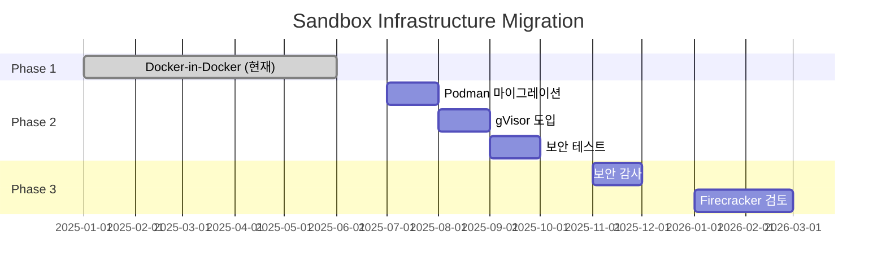

# RFC-010: Sandbox Infrastructure Architecture

| Field | Value |
|---|---|
| **RFC** | 010 |
| **Title** | Sandbox Infrastructure Architecture |
| **Author** | KILLHOUSE Team |
| **Status** | 📝 Draft |
| **Created** | 2026-02-13 |
| **Depends on** | RFC-001, RFC-004 |
| **Blocks** | — |

---

## Summary

RFC-004에서 정의한 샌드박스 격리 정책을 구현하기 위한 구체적인 인프라 아키텍처를 정의한다. 컨테이너 런타임 선택(Docker vs Podman vs gVisor), seccomp 프로파일 상세, 단계별 마이그레이션 로드맵, 그리고 비용 분석을 포함한다.

---

## Motivation

- RFC-004는 격리 정책의 **원칙**을 정의하지만, **구현 방법**은 TBD로 남겨둠
- 2025-2026년 발견된 컨테이너 보안 취약점(CVE-2025-9074 등)에 대한 대응 필요
- AI 에이전트용 샌드박스 기술의 급격한 발전에 따른 기술 선택 가이드 필요
- seccomp 프로파일의 구체적 syscall 허용/차단 목록 정의 필요

---

## Background: 컨테이너 격리 기술 비교

### 격리 수준 스펙트럼

```
┌─────────────────────────────────────────────────────────────────────┐
│                         격리 수준 스펙트럼                            │
├─────────────────────────────────────────────────────────────────────┤
│                                                                     │
│  약함 ◄──────────────────────────────────────────────────────► 강함 │
│                                                                     │
│  Container     gVisor       Kata          Firecracker     Full VM   │
│  (Docker)    (App Kernel)  (Light VM)    (microVM)       (QEMU)    │
│                                                                     │
│   ~10ms       50-100ms     150-300ms     100-200ms       10+ sec   │
│  공유 커널   유저스페이스    VM 격리       microVM 격리    완전 VM   │
│              커널 에뮬                                    격리      │
└─────────────────────────────────────────────────────────────────────┘
```

### 기술별 상세 비교

| 기술 | 아키텍처 | Cold Start | 보안 수준 | 오버헤드 | 적합 사례 |
|------|----------|------------|-----------|----------|-----------|
| **Docker/Podman** | 공유 커널 + namespace | ~10ms | 중간 | 최소 | 신뢰할 수 있는 코드 |
| **gVisor** | 유저스페이스 커널 | 50-100ms | 높음 | 중간 (56% 성능 저하) | 신뢰할 수 없는 코드 |
| **Kata Containers** | 경량 VM + OCI 호환 | 150-300ms | 매우 높음 | 높음 | 멀티테넌트 SaaS |
| **Firecracker** | microVM (Rust, 50K LOC) | 100-200ms | 매우 높음 | 낮음 (5MB) | 서버리스, FaaS |

### gVisor 아키텍처

```
┌─────────────────────────────────────────┐
│              Application                │
├─────────────────────────────────────────┤
│         Sentry (User-space Kernel)      │
│      - Go로 작성된 syscall 에뮬레이터   │
│      - ~70-80% Linux syscall 지원       │
│      - 24 syscall만 호스트 커널에 전달  │
├─────────────────────────────────────────┤
│             Host Kernel                 │
└─────────────────────────────────────────┘
```

**장점**:

- 하드웨어 가상화 불필요 (nested virtualization 미지원 환경에서 사용 가능)
- 기존 컨테이너 워크플로우 유지
- 커널 공격 표면 대폭 감소 (300+ syscall → 24 syscall)

**단점**:

- ptrace 모드: 95% 성능 저하
- KVM 모드: 56% 성능 저하
- eBPF, 고급 ioctl 미지원

### Firecracker 아키텍처

```
┌─────────────────────────────────────────┐
│            Guest Application            │
├─────────────────────────────────────────┤
│            Guest Linux Kernel           │
├─────────────────────────────────────────┤
│    Firecracker VMM (50K lines Rust)     │
│    - 최소화된 디바이스 에뮬레이션       │
│    - virtio-net, virtio-block만 지원    │
├─────────────────────────────────────────┤
│   Jailer (cgroups + namespaces + seccomp)│
│    - 24 syscall whitelist               │
│    - 30 ioctl whitelist                 │
├─────────────────────────────────────────┤
│               Host Kernel               │
└─────────────────────────────────────────┘
```

**장점**:

- AWS Lambda, Fargate에서 검증 (수백만 프로덕션 워크로드)
- 125ms 부팅, 초당 150개 microVM 생성
- 5MB 메모리 오버헤드
- 하드웨어 격리 (워크로드별 전용 커널)

**단점**:

- KVM 지원 필수 (VT-x/AMD-V)
- EC2 bare metal 또는 nested virtualization 필요
- 오케스트레이션 인프라 직접 구축 필요

---

## Proposal

### 아키텍처 옵션

| 옵션 | 격리 수준 | 복잡도 | 월 비용 | 권장 단계 |
|------|-----------|--------|---------|-----------|
| **Option A**: Docker + seccomp 강화 | 중간 | 낮음 | ~$80 | Phase 1 (현재) |
| **Option B**: Podman rootless + gVisor | 높음 | 중간 | ~$80 | **Phase 2 (권장)** |
| **Option C**: Firecracker 자체 구축 | 매우 높음 | 높음 | ~$100 | Phase 3 (장기) |
| **Option D**: E2B/Daytona 외부 서비스 | 매우 높음 | 낮음 | 사용량 기반 | 대안 |

### 권장 아키텍처: Option B (Podman + gVisor)

```
┌─────────────────────────────────────────────────────────────────────┐
│                    AWS VPC (Private Subnet)                         │
├─────────────────────────────────────────────────────────────────────┤
│                                                                     │
│  ┌───────────────────────────────────────────────────────────────┐  │
│  │                 EC2 (Exploit Agent Host)                      │  │
│  │                 Amazon Linux 2023 / t3.medium                 │  │
│  │                                                               │  │
│  │  ┌─────────────────────────────────────────────────────────┐  │  │
│  │  │              Podman (Rootless Mode)                     │  │  │
│  │  │              - 비특권 사용자로 실행                      │  │  │
│  │  │              - User namespace 격리                      │  │  │
│  │  │                                                         │  │  │
│  │  │  ┌───────────────────────────────────────────────────┐  │  │  │
│  │  │  │           gVisor Runtime (runsc)                  │  │  │  │
│  │  │  │                                                   │  │  │  │
│  │  │  │  ┌─────────────────────────────────────────────┐  │  │  │  │
│  │  │  │  │         Sandbox Container                   │  │  │  │  │
│  │  │  │  │  - AI 생성 exploit 코드 실행                │  │  │  │  │
│  │  │  │  │  - --network none                           │  │  │  │  │
│  │  │  │  │  - read-only rootfs                         │  │  │  │  │
│  │  │  │  │  - tmpfs /tmp:10GB                          │  │  │  │  │
│  │  │  │  │  - 300s timeout                             │  │  │  │  │
│  │  │  │  └─────────────────────────────────────────────┘  │  │  │  │
│  │  │  │                                                   │  │  │  │
│  │  │  │  Sentry (User-space Kernel)                      │  │  │  │
│  │  │  │  - syscall 인터셉션 및 에뮬레이션                │  │  │  │
│  │  │  │  - 300+ syscall → 24 syscall 변환               │  │  │  │
│  │  │  └───────────────────────────────────────────────────┘  │  │  │
│  │  │                                                         │  │  │
│  │  └─────────────────────────────────────────────────────────┘  │  │
│  │                                                               │  │
│  │  ┌─────────────────────────────────────────────────────────┐  │  │
│  │  │              Exploit Agent Container                    │  │  │
│  │  │  - 샌드박스 오케스트레이션                              │  │  │
│  │  │  - OpenAI API 통신 (outbound 443)                       │  │  │
│  │  │  - 결과 수집 및 Supabase 저장                           │  │  │
│  │  └─────────────────────────────────────────────────────────┘  │  │
│  │                                                               │  │
│  └───────────────────────────────────────────────────────────────┘  │
│                                                                     │
│  Security Groups:                                                   │
│  ┌─────────────────────────────────────────────────────────────┐    │
│  │ sg-agent:                                                   │    │
│  │   - Inbound: 8081/tcp from ECS (scanner-api)               │    │
│  │   - Outbound: 443/tcp (OpenAI), 5432/tcp (Supabase)        │    │
│  └─────────────────────────────────────────────────────────────┘    │
│  ┌─────────────────────────────────────────────────────────────┐    │
│  │ sg-sandbox (implicit via --network none):                   │    │
│  │   - All traffic: DENY                                       │    │
│  └─────────────────────────────────────────────────────────────┘    │
│                                                                     │
└─────────────────────────────────────────────────────────────────────┘
```

### 방어 심층 (Defense in Depth) 상세

```
┌─────────────────────────────────────────────────────────────────────┐
│                    Layer 6: 하드웨어 격리 (Phase 3)                  │
│                    - Firecracker microVM                            │
│                    - 전용 게스트 커널                               │
├─────────────────────────────────────────────────────────────────────┤
│                    Layer 5: 시간 제한                               │
│                    - 300초 실행 timeout                             │
│                    - 무한 루프/DoS 방지                             │
├─────────────────────────────────────────────────────────────────────┤
│                    Layer 4: 파일시스템 격리                         │
│                    - read-only root filesystem                      │
│                    - tmpfs /tmp (10GB, 디스크 미기록)               │
│                    - 볼륨 마운트 금지                               │
├─────────────────────────────────────────────────────────────────────┤
│                    Layer 3: 리소스 제한 (cgroups v2)                │
│                    - 4GB RAM                                        │
│                    - 2 vCPU (CFS quota)                             │
│                    - 256 PID limit                                  │
│                    - 10GB storage (tmpfs)                           │
├─────────────────────────────────────────────────────────────────────┤
│                    Layer 2: 컨테이너/런타임 격리                    │
│                    - gVisor (유저스페이스 커널)                     │
│                    - seccomp profile (커스텀)                       │
│                    - no-new-privileges                              │
│                    - dropped capabilities (ALL)                     │
│                    - Podman rootless (user namespace)               │
├─────────────────────────────────────────────────────────────────────┤
│                    Layer 1: 네트워크 격리                           │
│                    - --network none (완전 차단)                     │
│                    - Security Group sg-sandbox: DENY ALL            │
└─────────────────────────────────────────────────────────────────────┘
```

### seccomp 프로파일 정의

RFC-004 Open Issue #1 해결: 허용 syscall 목록

```json
{
  "defaultAction": "SCMP_ACT_ERRNO",
  "defaultErrnoRet": 1,
  "architectures": [
    "SCMP_ARCH_X86_64",
    "SCMP_ARCH_X86",
    "SCMP_ARCH_AARCH64"
  ],
  "syscalls": [
    {
      "comment": "기본 파일 I/O",
      "names": [
        "read", "write", "open", "openat", "close",
        "stat", "fstat", "lstat", "fstatat64",
        "lseek", "pread64", "pwrite64",
        "readv", "writev", "preadv", "pwritev"
      ],
      "action": "SCMP_ACT_ALLOW"
    },
    {
      "comment": "메모리 관리",
      "names": [
        "mmap", "mprotect", "munmap", "brk",
        "mremap", "msync", "mincore", "madvise",
        "mlock", "munlock"
      ],
      "action": "SCMP_ACT_ALLOW"
    },
    {
      "comment": "프로세스 관리",
      "names": [
        "clone", "clone3", "fork", "vfork", "execve", "execveat",
        "exit", "exit_group", "wait4", "waitid",
        "getpid", "getppid", "gettid",
        "getuid", "getgid", "geteuid", "getegid",
        "setuid", "setgid", "setreuid", "setregid",
        "getgroups", "setgroups"
      ],
      "action": "SCMP_ACT_ALLOW"
    },
    {
      "comment": "시그널 처리",
      "names": [
        "rt_sigaction", "rt_sigprocmask", "rt_sigreturn",
        "rt_sigsuspend", "rt_sigpending", "rt_sigtimedwait",
        "kill", "tgkill", "tkill"
      ],
      "action": "SCMP_ACT_ALLOW"
    },
    {
      "comment": "파일 디스크립터 관리",
      "names": [
        "dup", "dup2", "dup3",
        "fcntl", "flock",
        "pipe", "pipe2",
        "select", "pselect6",
        "poll", "ppoll",
        "epoll_create", "epoll_create1", "epoll_ctl", "epoll_wait", "epoll_pwait"
      ],
      "action": "SCMP_ACT_ALLOW"
    },
    {
      "comment": "파일시스템 작업",
      "names": [
        "access", "faccessat",
        "getcwd", "chdir", "fchdir",
        "mkdir", "mkdirat", "rmdir",
        "link", "linkat", "unlink", "unlinkat",
        "symlink", "symlinkat", "readlink", "readlinkat",
        "rename", "renameat", "renameat2",
        "chmod", "fchmod", "fchmodat",
        "chown", "fchown", "lchown", "fchownat",
        "truncate", "ftruncate",
        "statfs", "fstatfs",
        "getdents", "getdents64"
      ],
      "action": "SCMP_ACT_ALLOW"
    },
    {
      "comment": "시간 관련",
      "names": [
        "gettimeofday", "settimeofday",
        "clock_gettime", "clock_getres", "clock_nanosleep",
        "nanosleep", "time"
      ],
      "action": "SCMP_ACT_ALLOW"
    },
    {
      "comment": "기타 필수",
      "names": [
        "uname", "sysinfo",
        "prctl", "arch_prctl",
        "set_tid_address", "set_robust_list",
        "futex", "get_robust_list",
        "sched_yield", "sched_getaffinity", "sched_setaffinity",
        "getrlimit", "setrlimit", "prlimit64",
        "ioctl",
        "getrandom"
      ],
      "action": "SCMP_ACT_ALLOW"
    },
    {
      "comment": "io_uring 차단 (CVE 다수 - 반드시 차단)",
      "names": [
        "io_uring_setup",
        "io_uring_enter",
        "io_uring_register"
      ],
      "action": "SCMP_ACT_ERRNO",
      "errnoRet": 1
    },
    {
      "comment": "커널 모듈 로딩 차단",
      "names": [
        "init_module", "finit_module", "delete_module",
        "create_module", "query_module"
      ],
      "action": "SCMP_ACT_ERRNO",
      "errnoRet": 1
    },
    {
      "comment": "시스템 관리 차단",
      "names": [
        "reboot", "kexec_load", "kexec_file_load",
        "swapon", "swapoff",
        "acct", "quotactl",
        "nfsservctl"
      ],
      "action": "SCMP_ACT_ERRNO",
      "errnoRet": 1
    },
    {
      "comment": "마운트 작업 차단",
      "names": [
        "mount", "umount", "umount2",
        "pivot_root", "chroot"
      ],
      "action": "SCMP_ACT_ERRNO",
      "errnoRet": 1
    },
    {
      "comment": "네트워크 syscall 차단 (--network none과 함께)",
      "names": [
        "socket", "connect", "accept", "accept4",
        "bind", "listen", "sendto", "recvfrom",
        "sendmsg", "recvmsg", "shutdown",
        "setsockopt", "getsockopt",
        "getpeername", "getsockname"
      ],
      "action": "SCMP_ACT_ERRNO",
      "errnoRet": 101
    },
    {
      "comment": "디버깅/추적 차단",
      "names": [
        "ptrace", "process_vm_readv", "process_vm_writev",
        "kcmp", "lookup_dcookie"
      ],
      "action": "SCMP_ACT_ERRNO",
      "errnoRet": 1
    },
    {
      "comment": "기타 위험 syscall 차단",
      "names": [
        "personality", "uselib",
        "sysfs", "_sysctl",
        "keyctl", "add_key", "request_key",
        "mbind", "migrate_pages", "move_pages",
        "perf_event_open", "bpf"
      ],
      "action": "SCMP_ACT_ERRNO",
      "errnoRet": 1
    }
  ]
}
```

!!! danger "io_uring 차단 필수"
    io_uring은 2021년 이후 Linux 커널 취약점의 주요 원인. Google kCTF 분석에 따르면 다수의 컨테이너 탈출 취약점이 io_uring을 통해 발생. 반드시 차단 필요.

### Podman + gVisor 설치 및 설정

#### EC2 User Data Script

```bash
#!/bin/bash
set -euo pipefail

# Amazon Linux 2023 / Podman + gVisor 설치

# 1. Podman 설치
dnf install -y podman podman-docker

# 2. gVisor (runsc) 설치
ARCH=$(uname -m)
if [ "$ARCH" == "x86_64" ]; then
  URL="https://storage.googleapis.com/gvisor/releases/release/latest/x86_64"
elif [ "$ARCH" == "aarch64" ]; then
  URL="https://storage.googleapis.com/gvisor/releases/release/latest/aarch64"
fi

wget "${URL}/runsc" -O /usr/local/bin/runsc
wget "${URL}/containerd-shim-runsc-v1" -O /usr/local/bin/containerd-shim-runsc-v1
chmod +x /usr/local/bin/runsc /usr/local/bin/containerd-shim-runsc-v1

# 3. Podman에 gVisor 런타임 등록
mkdir -p /etc/containers/containers.conf.d
cat > /etc/containers/containers.conf.d/gvisor.conf << 'EOF'
[engine]
runtime = "runsc"

[engine.runtimes]
runsc = ["/usr/local/bin/runsc", "--platform=systrap"]
EOF

# 4. seccomp 프로파일 배치
mkdir -p /etc/killhouse
# (seccomp.json 파일은 별도로 배포)

# 5. Rootless Podman 설정
useradd -m killhouse
loginctl enable-linger killhouse

# 6. 격리 네트워크 생성 (실제로는 --network none 사용)
# podman network create --driver bridge --internal killhouse-isolated

echo "Podman + gVisor 설치 완료"
```

#### 샌드박스 실행 명령어

```bash
# 기본 실행 (gVisor 런타임)
podman run \
  --runtime runsc \
  --rm \
  --network none \
  --memory 4g \
  --cpus 2 \
  --pids-limit 256 \
  --read-only \
  --tmpfs /tmp:size=10g,mode=1777 \
  --security-opt no-new-privileges \
  --security-opt seccomp=/etc/killhouse/seccomp.json \
  --cap-drop ALL \
  --user 65534:65534 \
  ghcr.io/killhouse/exploit-sandbox:latest \
  timeout 300 /entrypoint.sh "$EXPLOIT_CODE"
```

| 옵션 | 설명 |
|------|------|
| `--runtime runsc` | gVisor 런타임 사용 |
| `--network none` | 네트워크 완전 차단 |
| `--memory 4g` | 4GB 메모리 제한 |
| `--cpus 2` | 2 vCPU 제한 |
| `--pids-limit 256` | Fork bomb 방지 |
| `--read-only` | Read-only root filesystem |
| `--tmpfs /tmp:size=10g` | 임시 저장소 (메모리 기반) |
| `--security-opt no-new-privileges` | 권한 상승 차단 |
| `--security-opt seccomp=...` | 커스텀 seccomp 프로파일 |
| `--cap-drop ALL` | 모든 capabilities 제거 |
| `--user 65534:65534` | nobody 사용자로 실행 |
| `timeout 300` | 300초 실행 제한 |

---

## Migration Roadmap

### Phase 1: 현재 상태 (MVP)

```
┌─────────────────────────────────────────────────────────────────┐
│  Status: ✅ 구현 완료                                           │
├─────────────────────────────────────────────────────────────────┤
│  - Docker-in-Docker on EC2                                      │
│  - --network none                                               │
│  - cgroup 리소스 제한 (CPU, RAM, PID)                           │
│  - 기본 Docker seccomp 프로파일                                 │
│  - killhouse-isolated bridge network                            │
├─────────────────────────────────────────────────────────────────┤
│  보안 수준: 중간                                                │
│  알려진 위험: 커널 취약점을 통한 컨테이너 탈출 가능              │
└─────────────────────────────────────────────────────────────────┘
```

### Phase 2: 보안 강화 (권장)

```
┌─────────────────────────────────────────────────────────────────┐
│  Status: 📋 계획됨                                              │
├─────────────────────────────────────────────────────────────────┤
│  Tasks:                                                         │
│  □ Docker → Podman rootless 마이그레이션                        │
│  □ 커스텀 seccomp 프로파일 적용 (io_uring 차단)                 │
│  □ gVisor (runsc) 런타임 도입                                   │
│  □ 상세 syscall 감사 로깅 구현                                  │
│  □ Resource Monitor 고도화                                      │
├─────────────────────────────────────────────────────────────────┤
│  보안 수준: 높음                                                │
│  커널 공격 표면: 300+ syscall → 24 syscall (92% 감소)           │
└─────────────────────────────────────────────────────────────────┘
```

### Phase 3: 최고 수준 격리 (장기)

```
┌─────────────────────────────────────────────────────────────────┐
│  Status: 📋 보안 감사 후 결정                                   │
├─────────────────────────────────────────────────────────────────┤
│  Tasks:                                                         │
│  □ Firecracker VMM 구축                                         │
│  □ Jailer 설정 (cgroups + namespaces + seccomp)                 │
│  □ 커스텀 게스트 커널 빌드                                      │
│  □ 오케스트레이션 레이어 개발                                   │
│  □ E2B/Kata Containers 하이브리드 검토                          │
├─────────────────────────────────────────────────────────────────┤
│  보안 수준: 매우 높음                                           │
│  하드웨어 격리: 워크로드별 전용 커널                            │
└─────────────────────────────────────────────────────────────────┘
```

### 마이그레이션 타임라인



---

## Alternatives

### Alt-1: E2B 외부 서비스 사용

AI 에이전트 전용 샌드박스 플랫폼 사용.

```
┌─────────────────────────────────────────────────────────────────┐
│  E2B Architecture                                               │
├─────────────────────────────────────────────────────────────────┤
│  - Firecracker microVM 기반                                     │
│  - ~150ms cold start                                            │
│  - Kubernetes 오케스트레이션                                    │
│  - SDK 제공 (Python, TypeScript)                                │
├─────────────────────────────────────────────────────────────────┤
│  장점:                                                          │
│  - 즉시 사용 가능                                               │
│  - 검증된 보안                                                  │
│  - 운영 부담 없음                                               │
├─────────────────────────────────────────────────────────────────┤
│  단점:                                                          │
│  - 외부 의존성                                                  │
│  - 장기 비용 (사용량 기반)                                      │
│  - 소스코드 외부 전송                                           │
├─────────────────────────────────────────────────────────────────┤
│  결정: 보류 - 자체 구축 우선, 트래픽 증가 시 하이브리드 검토    │
└─────────────────────────────────────────────────────────────────┘
```

### Alt-2: Daytona 사용

상태 유지 가능한 AI 코드 실행 환경.

```
┌─────────────────────────────────────────────────────────────────┐
│  Daytona Features                                               │
├─────────────────────────────────────────────────────────────────┤
│  - 27-90ms cold start (최고 속도)                               │
│  - Docker/Kata/Sysbox 격리 옵션                                 │
│  - 상태 유지 (persistent workspace)                             │
├─────────────────────────────────────────────────────────────────┤
│  결정: 기각 - 1회용 샌드박스 원칙과 상충                        │
└─────────────────────────────────────────────────────────────────┘
```

### Alt-3: AWS Fargate를 샌드박스로 사용

Fargate의 Firecracker 격리를 활용.

```
┌─────────────────────────────────────────────────────────────────┐
│  Fargate Sandbox 가능성                                         │
├─────────────────────────────────────────────────────────────────┤
│  장점:                                                          │
│  - 이미 Firecracker microVM 사용                                │
│  - 태스크당 전용 VM (하드웨어 격리)                             │
│  - 관리형 서비스                                                │
├─────────────────────────────────────────────────────────────────┤
│  단점:                                                          │
│  - --network none 미지원                                        │
│  - seccomp 커스터마이징 제한                                    │
│  - 짧은 실행에 비용 비효율                                      │
│  - Cold start 수 초 소요                                        │
├─────────────────────────────────────────────────────────────────┤
│  결정: 기각 - 네트워크 차단 불가                                │
└─────────────────────────────────────────────────────────────────┘
```

### Alt-4: Kata Containers

Kubernetes 네이티브 VM 격리.

```
┌─────────────────────────────────────────────────────────────────┐
│  Kata Containers                                                │
├─────────────────────────────────────────────────────────────────┤
│  장점:                                                          │
│  - OCI/CRI 호환                                                 │
│  - 프로덕션 레디 오케스트레이션                                 │
│  - VMM 선택 가능 (Firecracker, Cloud Hypervisor)                │
├─────────────────────────────────────────────────────────────────┤
│  단점:                                                          │
│  - Kubernetes 필요 (현재 ECS 사용)                              │
│  - 복잡한 설정                                                  │
│  - 150-300ms cold start                                         │
├─────────────────────────────────────────────────────────────────┤
│  결정: 보류 - Kubernetes 전환 시 재검토                         │
└─────────────────────────────────────────────────────────────────┘
```

---

## Security Considerations

### 위협 모델 업데이트

| 위협 | 현재 완화 (Phase 1) | 개선된 완화 (Phase 2) |
|------|---------------------|----------------------|
| **컨테이너 탈출** | seccomp (기본), no-new-privileges | gVisor (커널 공격 표면 92% 감소) |
| **커널 취약점** | 패치 관리 | gVisor (호스트 커널 미노출) |
| **io_uring 취약점** | ❌ 차단 안 됨 | ✅ seccomp에서 명시적 차단 |
| **네트워크 공격** | --network none | --network none (유지) |
| **리소스 소진** | cgroup 제한 | cgroup 제한 (유지) |
| **CVE-2025-9074** | ❌ 취약 (Docker Desktop) | ✅ Podman rootless |

### 2025-2026 주요 취약점 대응

!!! warning "CVE-2025-9074 (Docker Desktop)"
    Docker Desktop의 SSRF 취약점으로, 컨테이너가 Docker Engine API에 접근 가능.
    3줄 Python으로 exploit 가능.
    **대응**: Podman rootless 사용, Docker Desktop 미사용

!!! warning "io_uring 취약점 시리즈"
    io_uring은 2021년 이후 Linux 커널 취약점의 주요 원인.
    Google kCTF 분석: 다수의 컨테이너 탈출이 io_uring 통해 발생.
    **대응**: seccomp에서 io_uring syscall 명시적 차단

!!! warning "ShadowV2 봇넷"
    AWS EC2의 노출된 Docker daemon을 타겟으로 하는 봇넷.
    **대응**: Docker socket 미노출, Security Group 최소화

---

## Cost Analysis

### 월간 인프라 비용

| 구성 요소 | Phase 1 (현재) | Phase 2 (gVisor) | Phase 3 (Firecracker) |
|-----------|----------------|------------------|----------------------|
| EC2 (t3.medium) | $30 | $30 | $45 (larger instance) |
| EBS 스토리지 | $10 | $10 | $15 |
| NAT Gateway | $35 | $35 | $35 |
| 데이터 전송 | $5 | $5 | $5 |
| **합계** | **$80** | **$80** | **$100** |

### 외부 서비스 vs 자체 구축

| 접근 방식 | 초기 비용 | 월 운영 비용 | 장점 | 단점 |
|-----------|-----------|--------------|------|------|
| **자체 구축** | 개발 비용 | $80-100 | 완전한 통제, 낮은 장기 비용 | 개발/운영 부담 |
| **E2B** | 없음 | $0.0001/초 | 즉시 사용, 검증된 보안 | 의존성, 장기 비용 증가 |
| **Daytona** | 없음 | 엔터프라이즈 | 빠른 시작 | 비용 불투명 |

### 권장

초기에는 자체 구축 (Phase 1-2), 트래픽 급증 시 E2B 하이브리드 검토.

---

## Open Issues

RFC-004의 Open Issues 해결 상태:

| # | 이슈 | 상태 | 해결 내용 |
|---|------|------|----------|
| 1 | seccomp 프로파일 세부 정책 | ✅ 해결 | 본 RFC에서 정의 |
| 2 | sandbox 기본 이미지 도구 | 📋 열림 | 지원 언어 확정 후 결정 |
| 3 | gVisor 도입 시점 | ✅ 해결 | Phase 2로 계획 |
| 4 | 동시 sandbox 최대 수 | 📋 열림 | 벤치마크 후 결정 |
| 5 | 출력 로깅 정책 | 📋 열림 | 컴플라이언스 확인 후 |

### 신규 Open Issues

| # | 이슈 | 결정 필요 시점 |
|---|------|----------------|
| 6 | gVisor KVM vs systrap 모드 선택 | Phase 2 구현 시 |
| 7 | Firecracker 도입 기준 정의 | Phase 3 검토 시 |
| 8 | E2B 하이브리드 트리거 조건 | 트래픽 분석 후 |
| 9 | Kubernetes 전환 시 Kata Containers 검토 | ECS→EKS 전환 시 |

---

## References

### 격리 기술 비교

- [Kata Containers vs Firecracker vs gVisor - Northflank](https://northflank.com/blog/kata-containers-vs-firecracker-vs-gvisor)
- [Firecracker vs gVisor - Northflank](https://northflank.com/blog/firecracker-vs-gvisor)
- [Making Containers More Isolated - Palo Alto Unit42](https://unit42.paloaltonetworks.com/making-containers-more-isolated-an-overview-of-sandboxed-container-technologies/)
- [Choosing a Workspace for AI Agents - Medium](https://medium.com/@iSoftStone/choosing-a-workspace-for-ai-agents-the-ultimate-showdown-between-gvisor-kata-and-firecracker-46a8528ae37c)

### Docker/Container 보안

- [Docker Security Announcements](https://docs.docker.com/security/security-announcements/)
- [CVE-2025-9074 Analysis - Pvotal](https://pvotal.tech/breaking-dockers-isolation-using-docker-cve-2025-9074/)
- [Docker Sandboxes for AI - Docker Blog](https://www.docker.com/blog/docker-sandboxes-a-new-approach-for-coding-agent-safety/)
- [Docker Security Best Practices AWS 2025 - Medium](https://medium.com/@Nelsonalfonso/docker-security-best-practices-for-using-aws-2025-15dbc8c64395)

### AWS Fargate

- [AWS Fargate Security Overview Whitepaper](https://d1.awsstatic.com/whitepapers/AWS_Fargate_Security_Overview_Whitepaper.pdf)
- [Fargate Security Considerations - AWS Docs](https://docs.aws.amazon.com/AmazonECS/latest/developerguide/fargate-security-considerations.html)
- [ECS Fargate Threat Modeling - Sysdig](https://www.sysdig.com/blog/ecs-fargate-threat-modeling/)

### AI 샌드박스 플랫폼

- [E2B Documentation](https://e2b.dev/docs)
- [Top AI Code Sandbox Products - Modal](https://modal.com/blog/top-code-agent-sandbox-products)
- [Daytona vs E2B - Northflank](https://northflank.com/blog/daytona-vs-e2b-ai-code-execution-sandboxes)
- [Awesome Sandbox for AI - GitHub](https://github.com/restyler/awesome-sandbox)

### seccomp

- [Docker seccomp Profiles - Docker Docs](https://docs.docker.com/engine/security/seccomp/)
- [Container Security Fundamentals: seccomp - Datadog](https://securitylabs.datadoghq.com/articles/container-security-fundamentals-part-6/)
- [Kubernetes seccomp Tutorial](https://kubernetes.io/docs/tutorials/security/seccomp/)
- [Securing Containers with Seccomp - GitGuardian](https://blog.gitguardian.com/securing-containers-with-seccomp/)

### 내부 문서

- [RFC-001 Network Topology](rfc-001-network-topology.md) — sg-sandbox 규칙
- [RFC-004 Sandbox Isolation](rfc-004-sandbox-isolation.md) — 기본 격리 정책
